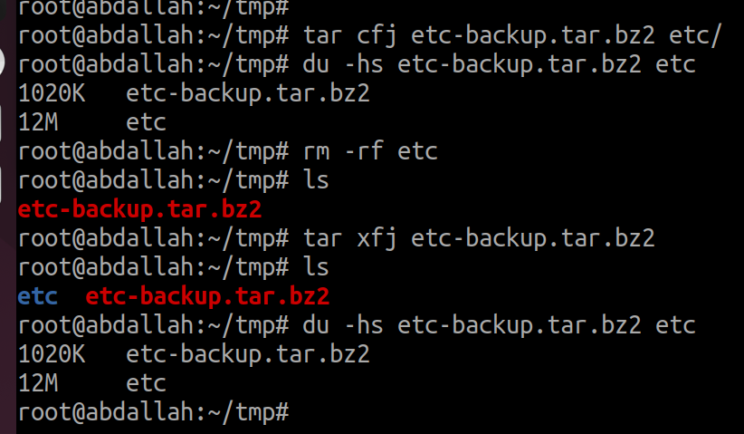

## 1.files Compression 
### gzip --> fast 
### bzip2 --> high compression rate


### compression directories and files 
### we will use tar to archive tree of files and directories
```bash
$ tar cf <tar-name.tar> <files to archive>
cf --> create file
```


```bash
$ tar xf <tar-name.tar> 
xf --> extract, file
```


### how to compress files and directories ?

### 1. gzip compression
```bash
$ tar cfz <tar-name.tar.gz> <files to copress>
$ tar xfz <tar-name.tar.gz> 

```


### .bz2 compression
```bash
$ tar cfj <tar-name.tar.bz2> <files to copress>
$ tar xfj <tar-name.tar.bz2> 
```


