**quotas** are a way to limit the amount of disk space and the number of files (inodes) that a user or group can use. Quotas ensure that no single user can exhaust the available disk space, which is especially useful in multi-user environments such as servers or shared workstations.


- **Soft Limit**: The maximum amount of disk space a user can use, but this limit can be temporarily exceeded. Users are usually notified if they go beyond this limit and have a grace period to get back under it.
    
- **Hard Limit**: The absolute maximum amount of disk space a user can use. Once this limit is reached, no further files can be created until usage drops below the hard limit.

so if we make the limit size for user is 20G( **Hard Limit**) and the **Soft Limit** is 19G
when this user use 19G he will warned but he can write data until 20G .

### implementation 
1-create the space
```
root@abdallah-VirtualBox:~# lvcreate --size=7G --name=quota-test vg1
WARNING: ext4 signature detected on /dev/vg1/quota-test at offset 1080. Wipe it? [y/n]: y
  Wiping ext4 signature on /dev/vg1/quota-test.
  Logical volume "quota-test" created.

root@abdallah-VirtualBox:~# lvs
  LV         VG  Attr       LSize Pool Origin Data%  Meta%  Move Log Cpy%Sync Convert
  quota-test vg1 -wi-a----- 7.00g

```

2-create the file system 
```
root@abdallah-VirtualBox:~# mkfs.ext4 /dev/vg1/quota-test
mke2fs 1.46.5 (30-Dec-2021)
Creating filesystem with 1835008 4k blocks and 458752 inodes
Filesystem UUID: cedf917f-8392-4eae-8c99-a2d9625ffa5e
Superblock backups stored on blocks:
        32768, 98304, 163840, 229376, 294912, 819200, 884736, 1605632

Allocating group tables: done
Writing inode tables: done
Creating journal (16384 blocks): done
Writing superblocks and filesystem accounting information: done


```
3-create qouta while the mount 
```

root@abdallah-VirtualBox:~# mount -o usrquota,grpquota /dev/vg1/quota-test /media/
root@abdallah-VirtualBox:~# mount | grep "/media"
/dev/mapper/vg1-quota--test on /media type ext4 (rw,relatime,quota,usrquota,grpquota)
```

we can add it in the /etc/fstab
```
/dev/vg1/quota-test  /media ext4 defaults,usrquota,grpquota 0 0
```
4-create the database for user and group
```
quotacheck: Your kernel probably supports ext4 quota feature but you are using external quota files. Please switch your filesystem to use ext4 quota feature as external quota files on e
```


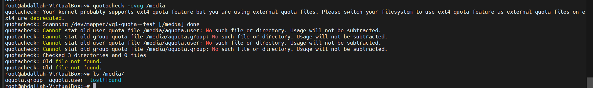

5-enable quota 
```
root@abdallah-VirtualBox:~# quotaon /media/
```


6-make the limitation on the block size
```
root@abdallah-VirtualBox:~# edquota -u omar
```

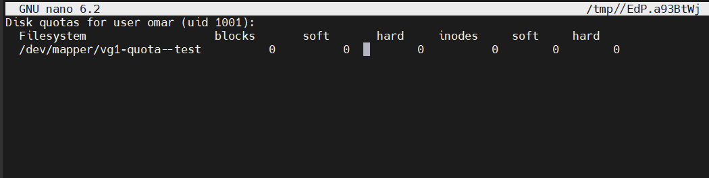

make the soft limit is 100M and the hard limit is 200M
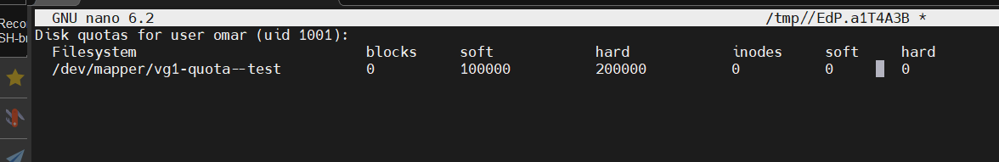


just switch to the omar user and create file under the mounted partition then exit 
```
root@abdallah-VirtualBox:~# repquota /media/
*** Report for user quotas on device /dev/mapper/vg1-quota--test
Block grace time: 7days; Inode grace time: 7days
                        Block limits                File limits
User            used    soft    hard  grace    used  soft  hard  grace
----------------------------------------------------------------------
root      --      20       0       0              2     0     0
omar      --       0  100000  200000              1     0     0
```


now to test this we will create file with size  50 M first 
```
root@abdallah-VirtualBox:~# su omar
omar@abdallah-VirtualBox:/root$ cd /media/
omar@abdallah-VirtualBox:/media$ dd if=/dev/zero of=bigfile1 bs=1M count=50
50+0 records in
50+0 records out
52428800 bytes (52 MB, 50 MiB) copied, 0.0249457 s, 2.1 GB/s

```

the size used by omar now is 50M 
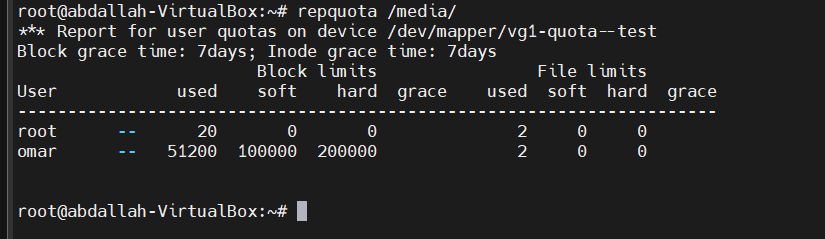

we will write another 100M to make the total is 150M 
 
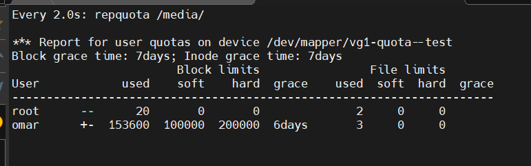

[+] here in that the user exceed the soft limit 

if we write data that make the omar user exceed 200M , it will write only with size that make the total is equal to 200M
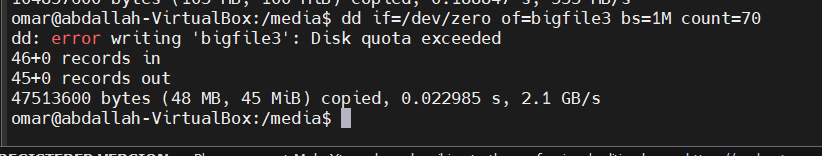
here i try to write 70M but the actual size written is only 46M
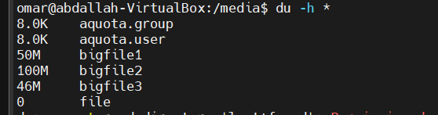

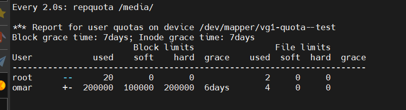


6-make the limitation on the number of files (inode)
lets delete all the files and create 10 files
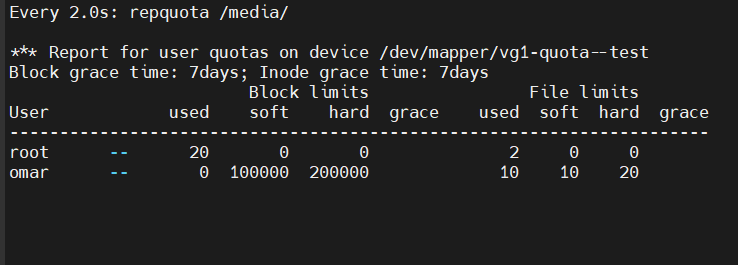

when the number of files exceed 20 file (20 inode) it can't create any file 
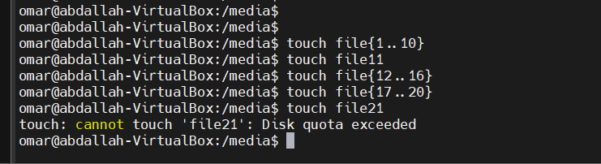

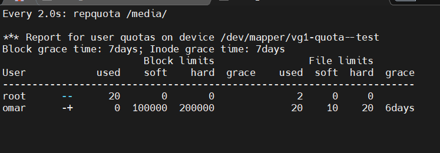


we can implement the quota for group with the same way 
```
root@abdallah-VirtualBox:~# edquota -g group1
```

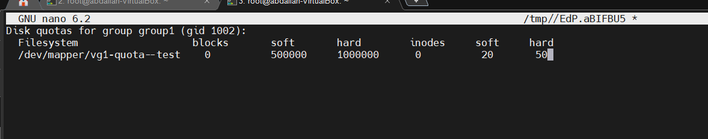
### Grace Period Functionality:
- When a user exceeds their **soft quota**, the system allows them to continue using more disk space (or inodes) for a specific period (the grace period).
- During the grace period, users are expected to reduce their usage below the soft limit.
- If the grace period expires and the user is still exceeding the soft quota, they won't be able to write any more data until their usage is reduced below the soft limit.

to change the grace period 
```
root@abdallah-VirtualBox:~# edquota -t
```
make it one minutes for block and 2 minutes for inodes for test

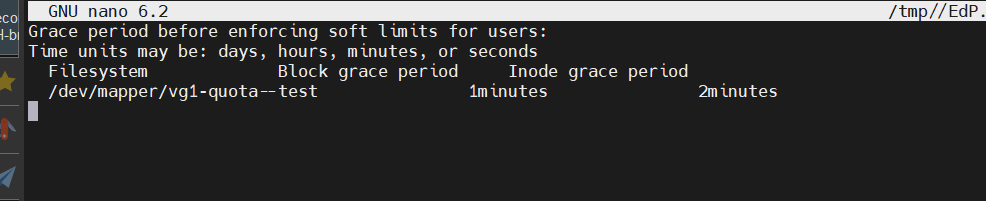

here we exceed the soft and the grace period start and i can create more files until the grace expire 
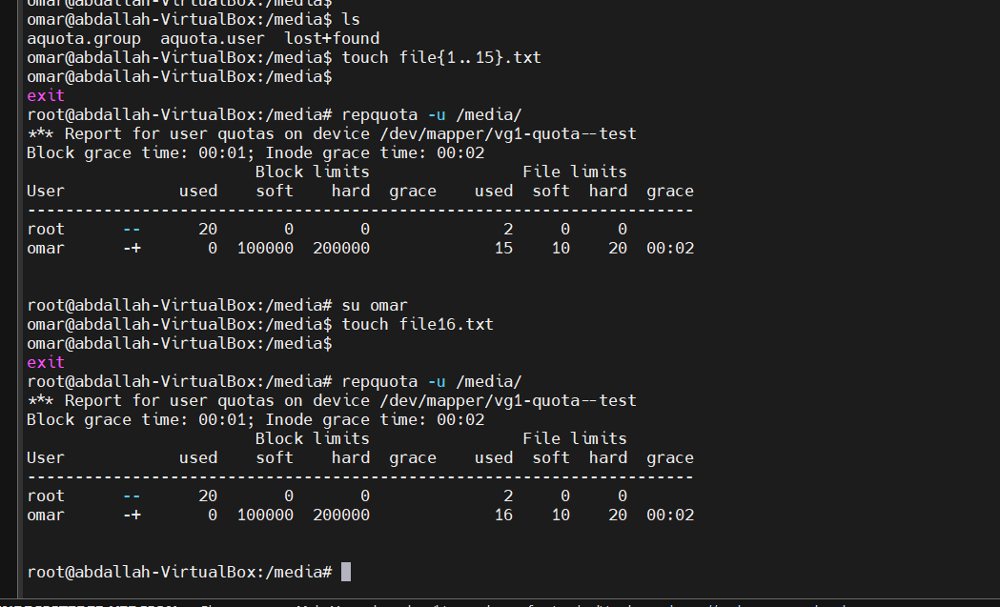

after the grace period

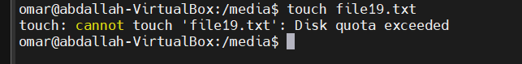

to disable quota
```
root@abdallah-VirtualBox:/media# quotaoff /media/

```
there is no limitation now and no records in the database also 

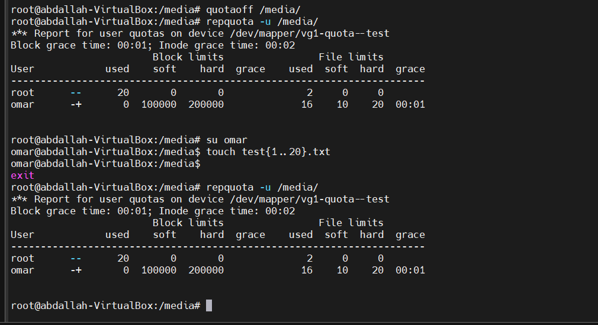

if we want to enable it again , it will be must to re-create the database then enable it
```
root@abdallah-VirtualBox:/media# quotacheck -vuf /media/
root@abdallah-VirtualBox:/media# quotaon /media/

```
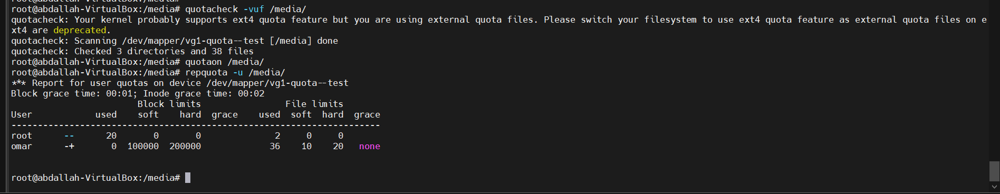

note that the number of files is 36 exceed the hard limit because we create these files when the quota was disable.

