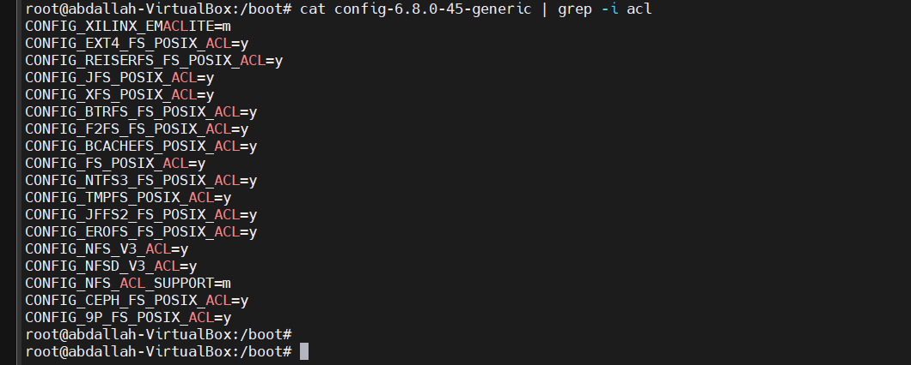
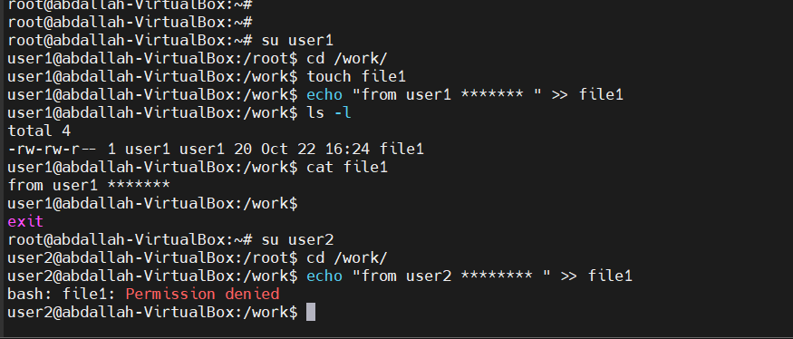
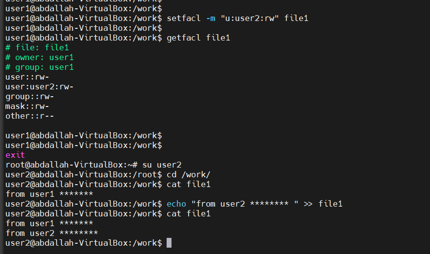

Access Control Lists (ACLs) provide an extended, more flexible permission mechanism for Linux file systems, allowing administrators to set specific permissions for individual users or groups.


### Why Use ACLs?

Think of a scenario in which a particular user is not a member of a group created by you but still, you want to give some read or write access, how can you do it without making the user a member of the group, here comes in picture Access Control Lists, ACL helps us to do this trick. Basically, ACLs are used to make a flexible permission mechanism in Linux. From Linux man pages, ACLs are used to define more fine-grained discretionary access rights for files and directories.

## Syntax

The two main commands for managing ACLs are:

setfacl: Used to set ACL entries.

getfacl: Used to retrieve and display ACL entries.




**`CONFIG_<FS>_POSIX_ACL=y`**: This means that the specific file system (e.g., EXT4, BTRFS, XFS, etc.) supports **POSIX ACLs** and that the support for ACLs is enabled in the kernel
**`CONFIG_<FS>_POSIX_ACL=m`**: This indicates that the ACL support for a particular file system is compiled as a **module** (`m`), meaning it can be loaded dynamically when needed rather than being built directly into the kernel.

The list shows various file systems that support ACLs, such as:
- **EXT4** (`CONFIG_EXT4_FS_POSIX_ACL=y`)
- **BTRFS** (`CONFIG_BTRFS_FS_POSIX_ACL=y`)
- **XFS** (`CONFIG_XFS_POSIX_ACL=y`)
- **TMPFS** (`CONFIG_TMPFS_POSIX_ACL=y`)
- **NFS** (Network File System) ACL support (`CONFIG_NFS_ACL_SUPPORT=m`)
- **NTFS3** (New Technology File System v3) ACL support (`CONFIG_NTFS3_FS_POSIX_ACL=y`)
- **Ceph** (a distributed file system) ACL support (`CONFIG_CEPH_FS_POSIX_ACL=y`)


### implementation

1-let's create two users 
```
root@abdallah-VirtualBox:~# useradd -m -s /bin/bash user1
root@abdallah-VirtualBox:~# useradd -m -s /bin/bash user2
root@abdallah-VirtualBox:~# ls /home/
abdallah  snap  user1  user2
```


there is no permission for user2 to do anything in file1 because it owned by user1

give user 2 permission to read and write to this file
```
user1@abdallah-VirtualBox:/work$ setfacl -m "u:user2:rw" file1
user1@abdallah-VirtualBox:/work$
user1@abdallah-VirtualBox:/work$ getfacl file1
# file: file1
# owner: user1
# group: user1
user::rw-
user:user2:rw-
group::rw-
mask::rw-
other::r--
```

now user2 can read and write (from/to) this file


we can make it to group also
```
setfacl -m "g:group:permissions" /path/to/file
```

**Common options**:
- `-m` (modify): Modifies an ACL by adding or updating an entry.
- `-x` (remove): Removes a specific ACL entry.
- `-b` (remove all): Removes all ACL entries and restores default permissions.
- `-R` (recursive): Apply the ACL changes recursively to a directory and its contents.
- `-d` (default): Set default ACL for new files and directories.


To allow all files or directories to inherit ACL entries from the directory it is within
setfacl -dm "entry" /path/to/dir

To remove a specific entry
setfacl -x "entry" /path/to/file


To remove all entries
setfacl -b path/to/file
