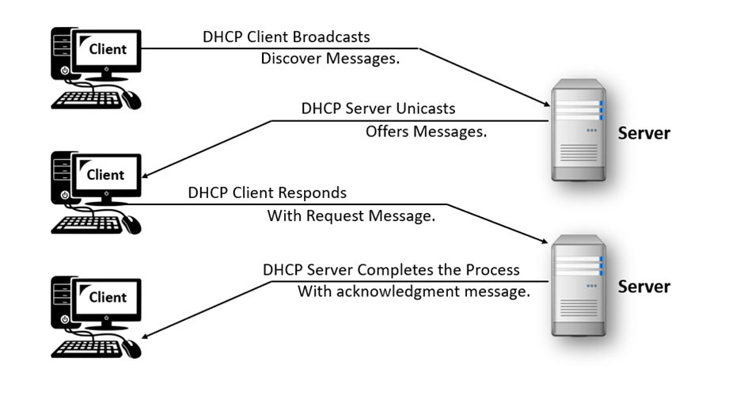
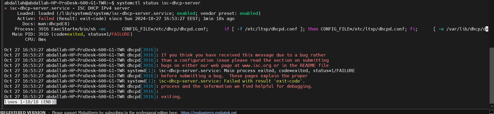
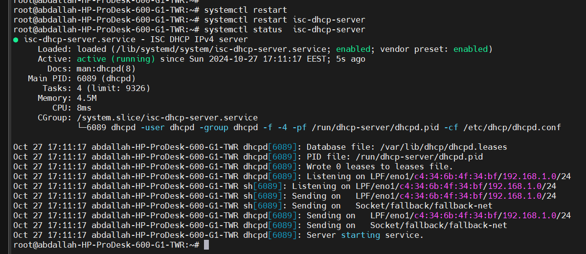

**Dynamic Host Configuration Protocol(DHCP) is a network protocol that automates the assignment of IP addresses and other network configuration parameters to devices on a network.**
DHCP operates as a client-server protocol, with servers overseeing a reservoir of distinct IP addresses and client configuration details. Subsequently, addresses are allocated from these pools by the servers. Whenever DHCP-enabled clients join a network, they transmit a request to the DHCP server.

How DHCP Works and DORA Steps
The DHCP process for IP address assignment follows the **DORA** sequence:

1. **Discover**: The client device sends a DHCP Discover message to locate available DHCP servers.
2. **Offer**: The DHCP server responds with an Offer message, which contains an available IP address and other network configuration details.
3. **Request**: The client responds with a DHCP Request message, requesting the offered IP address and configuration.
4. **Acknowledge**: The DHCP server sends an Acknowledge message, confirming that the IP address has been assigned to the client. At this point, the client can start using the assigned IP address.


### Configuring a DHCP Server on Linux
#### Step 1: Install the DHCP Server
```
sudo apt update
sudo apt install isc-dhcp-server
```



**The configuration file for ISC DHCP is located at _/etc/dhcp/dhcpd.conf_**. Before making any changes, it’s wise to create a backup of the original file using
```
 sudo cp /etc/dhcp/dhcpd.conf /etc/dhcp/dhcpd.conf.bak
 sudo nano /etc/dhcp/dhcpd.conf
```
 
 We need to add a section for a subnet if it doesn’t already exist and modify it according to our network settings:
```
subnet 192.168.1.0 netmask 255.255.255.0 {
  range 192.168.1.10 192.168.1.50;
  option subnet-mask 255.255.255.0;
  option routers 192.168.1.1;
  option domain-name-servers 8.8.8.8, 8.8.4.4;
  option domain-name "example.com";
  default-lease-time 7200;
  max-lease-time 10800;
}
```


In this basic configuration, we allocate IP addresses in the range from _192.168.1.10_ to _192.168.1.50_. We also specify our [subnet mask], [default gateway] (router), and [DNS servers].
### Breakdown of Each Configuration Line

1. **`subnet 192.168.1.0 netmask 255.255.255.0 { ... }`**  
    This line defines the subnet range that the DHCP server will serve. Here:
    
    - `192.168.1.0` is the network address for the subnet.
    - `netmask 255.255.255.0` specifies the subnet mask, which indicates the network and host portions of the IP address.
    
    With this configuration, any device with an IP address in the range `192.168.1.0` to `192.168.1.255` will be in this subnet.
    
2. **`range 192.168.1.10 192.168.1.50;`**  
    This specifies the range of IP addresses within the subnet that the DHCP server can assign to clients. The server will assign IPs starting from `192.168.1.10` up to `192.168.1.50`.
    
3. **`option subnet-mask 255.255.255.0;`**  
    This specifies the subnet mask that will be provided to clients in this subnet, allowing clients to determine the network portion of their IP address.
    
4. **`option routers 192.168.1.1;`**  
    This line sets the default gateway for clients, which is typically the IP address of the router. Clients will use `192.168.1.1` as their gateway to access external networks.
    
5. **`option domain-name-servers 8.8.8.8, 8.8.4.4;`**  
    This line provides the DNS servers that clients should use to resolve domain names. In this case, it’s using Google’s public DNS servers (`8.8.8.8` and `8.8.4.4`).
    
6. **`option domain-name "example.com";`**  
    This specifies a default domain name that will be appended to unqualified names for clients in this subnet. For instance, if a client tries to access a server named "host", the system will attempt "host.example.com".
    
7. **`default-lease-time 7200;`**  
    This sets the default lease time in seconds for an IP address. If the client does not request a specific lease time, it will receive a lease of 7200 seconds (2 hours).
    
8. **`max-lease-time 10800;`**  
    This sets the maximum lease time, which is the longest duration a client can hold an IP lease. Here, it’s set to 10800 seconds (3 hours) .
if the client misses the 2 hours renewal window, it can still continue using the same IP for up to 3 hours before needing to renew it.


```
root@abdallah-HP-ProDesk-600-G1-TWR:~# systemctl restart isc-dhcp-server
root@abdallah-HP-ProDesk-600-G1-TWR:~# systemctl status  isc-dhcp-server

```



DHCP Client Configuration on Linux

1.Install DHCP Client

On most systems, `dhclient` is already installed. To install it manually:
```
sudo apt install dhclient
```

2.Obtain an IP Address Using DHCP
Use `dhclient` to request an IP address from the DHCP server:
```
sudo dhclient -v
```

