iSCSI an acronym for **Internet Small Computer Systems Interface** , an Internet Protocol (IP)-based storage networking standard for linking data storage facilities. It provides block-level access to storage devices by carrying SCSI commands over a TCP/IP network.

The protocol allows clients (called _initiators_) to send SCSI commands (CDBs) to storage devices (_targets_) on remote servers. It is a storage area network (SAN) protocol, allowing organizations to consolidate storage into storage arrays while providing clients (such as database and web servers) with the illusion of locally attached SCSI disks.

### iSCSI Components

- **iSCSI Target**: The server that provides storage resources over the network.
- **iSCSI Initiator**: The client that connects to the iSCSI target to access the storage resources.


### iSCSI  Install

```bash
sudo apt-get install targetcli-fb
```

we have logical volume 10G from volume group 15G

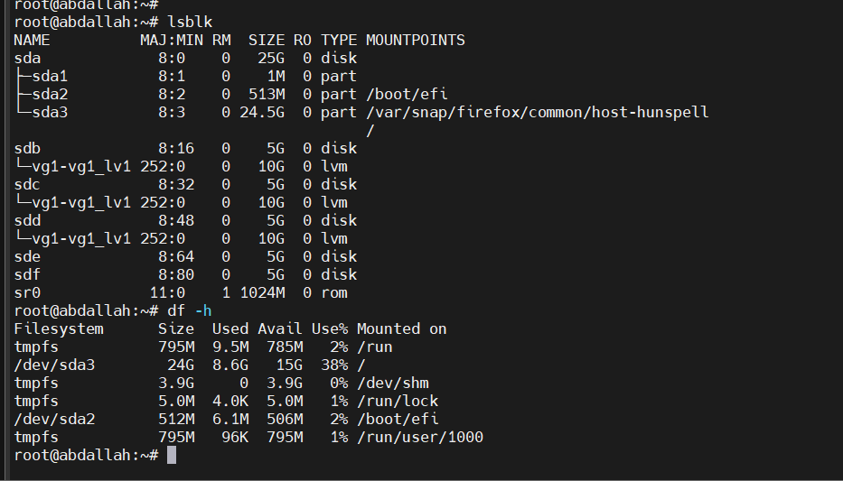

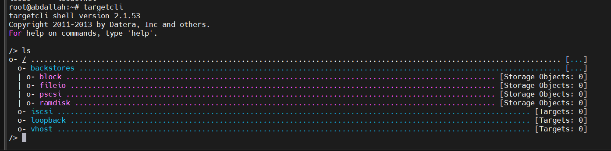
- **backstores**:
    
    - This is where you define the actual storage devices (or "backing stores") that will serve as the data sources for iSCSI targets. Each type of backstore represents a different kind of storage:
        - **block**: Represents block devices like physical disks (`/dev/sdb`, `/dev/sdc`, etc.).
        - **fileio**: Represents files on the filesystem used as virtual block devices (e.g., a disk image file).
        - **pscsi**: Allows direct SCSI passthrough to physical SCSI devices.
        - **ramdisk**: Uses RAM to create a volatile storage device, which is cleared on reboot.
    
    You can create a backstore under these categories to serve as the storage unit for your iSCSI target.
    
- **iscsi**:
    
    - This node is for creating and managing **iSCSI targets**, which are the endpoints that clients (initiators) connect to over the network. Each target has a unique name called an iSCSI Qualified Name (IQN), and the target must have access to at least one backstore to be useful.
    - In this node, you configure targets, set up LUNs (Logical Unit Numbers) that map backstores to the target, and manage authentication and access controls.
- **loopback**:
    
    - Loopback targets allow you to create storage targets that only the local system can access, useful mainly for testing and debugging.
- **vhost**:
    
    - This is a specialized target type for providing storage to virtual machines via a hypervisor, such as QEMU/KVM.

### create a backstore(block)
```bash
/backstores/block> create backstores_block1 /dev/vg1/vg1_lv1
Created block storage object backstores_block1 using /dev/vg1/vg1_lv1.
```

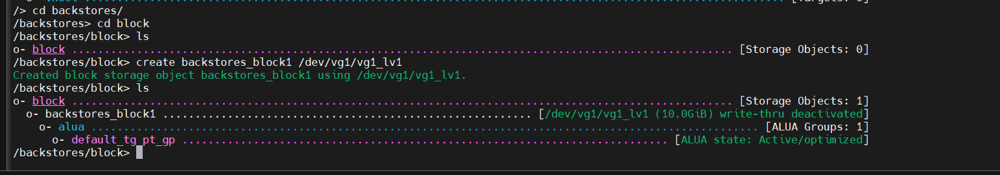

### Create an iSCSI Target:

```bash
/> cd iscsi
/iscsi> create iqn.2024-11.com.abdallah.server
Created target iqn.2024-11.com.abdallah.server.
Created TPG 1.
Global pref auto_add_default_portal=true
Created default portal listening on all IPs (0.0.0.0), port 3260.

```


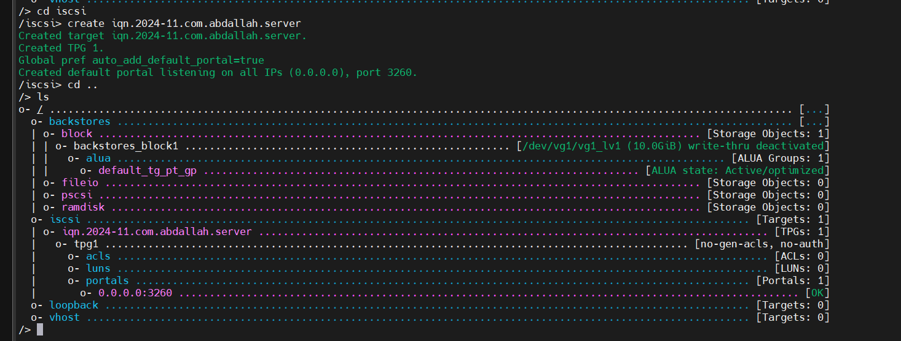
The **IQN (iSCSI Qualified Name)** is a unique identifier for an iSCSI device. It is used to identify both iSCSI initiators (clients) and targets (servers) in a standardized way, allowing them to connect over an IP network. The IQN format helps ensure that devices on an iSCSI network are uniquely identifiable, similar to how IP addresses or MAC addresses function.
### IQN Format

The IQN format is standardized and generally follows this structure:

```
iqn.YYYY-MM.reverse_domain_name.server_name
```

- **acls [ACLs: 0]**:
    - Access Control Lists for initiators (clients) that are allowed to connect.
    - `[ACLs: 0]` shows that no specific initiators are currently authorized to connect.
    - To allow an initiator access, you would add its IQN here.
- **luns [LUNs: 0]**:
    - Logical Unit Numbers (LUNs) represent storage units (backstores) assigned to this target.
    - `[LUNs: 0]` means no backstore has been assigned yet. You’d typically assign a LUN to give the target access to a specific storage backstore, like a disk or a file.
- **portals [Portals: 1]**:
    - Portals define the IP address and port number that clients use to connect to the target.
    - Here, there’s one portal listed: `0.0.0.0:3260`.
        - **0.0.0.0**: This means the target is listening on all available network interfaces.
        - **3260**: This is the default port for iSCSI traffic.

#### create acl 
```bash
/> cd iscsi/iqn.2024-11.com.abdallah.server/tpg1/acls
/iscsi/iqn.20...ver/tpg1/acls> ls
o- acls .................................................................................................................. [ACLs: 0]
/iscsi/iqn.20...ver/tpg1/acls> create iqn.2024-11.com.abdallah.client
Created Node ACL for iqn.2024-11.com.abdallah.client
```

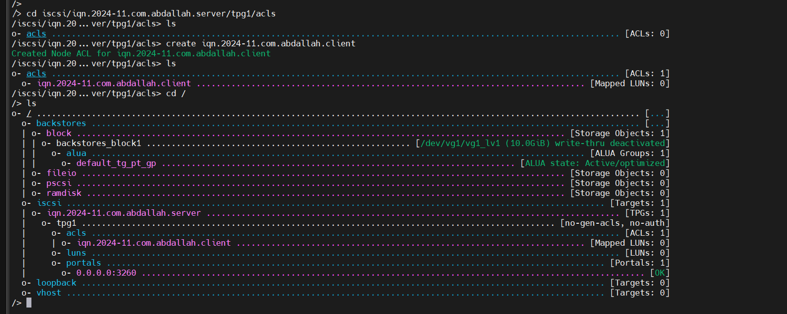
we can add username and password to the client  for authentication
```bash
/> cd iscsi/iqn.2024-11.com.abdallah.server/tpg1/acls/iqn.2024-11.com.abdallah.client/
/iscsi/iqn.20...dallah.client> set auth userid=abdallah
Parameter userid is now 'abdallah'.
/iscsi/iqn.20...dallah.client> set auth password=abdallah123
Parameter password is now 'abdallah123'.
```

#### create lun
```bash
/>
/> cd iscsi/iqn.2024-11.com.abdallah.server/tpg1/luns
/iscsi/iqn.20...ver/tpg1/luns> create /backstores/block/backstores_block1
Created LUN 0.
Created LUN 0->0 mapping in node ACL iqn.2024-11.com.abdallah.client

```

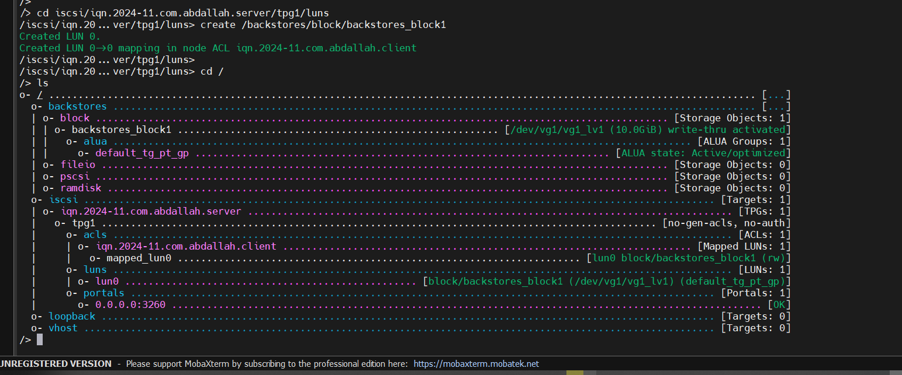


once you exit , automatic saving occur in  /etc/rtslib-fb-target/saveconfig.json
```bash
/> exit
Global pref auto_save_on_exit=true
Configuration saved to /etc/rtslib-fb-target/saveconfig.json

```

the system listen on port 3260 (iscsi port)

```
root@abdallah:~# netstat -ntlp | grep 3260
tcp        0      0 0.0.0.0:3260            0.0.0.0:*               LISTEN      -

```


### for the client 
## iSCSI Initiator Install

To configure Ubuntu Server as an iSCSI initiator install the open-iscsi package. In a terminal enter:
```bash
sudo apt install open-iscsi
```

Once the package is installed you will find the following files:
- /etc/iscsi/iscsid.conf
- /etc/iscsi/initiatorname.iscsi

first modify the initiatorname
```bash
root@abdallah:~# nano /etc/iscsi/initiatorname.iscsi
```
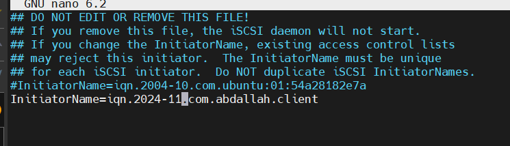


```bash
root@abdallah:~# systemctl enable --now iscsid
root@abdallah:~# systemctl status iscsid
● iscsid.service - iSCSI initiator daemon (iscsid)
     Loaded: loaded (/lib/systemd/system/iscsid.service; enabled; vendor preset: enabled)
     Active: active (running) since Tue 2024-11-05 22:25:10 EET; 7s ago
TriggeredBy: ● iscsid.socket
       Docs: man:iscsid(8)
    Process: 24365 ExecStartPre=/lib/open-iscsi/startup-checks.sh (code=exited, status=0/SUCCESS)
    Process: 24372 ExecStart=/sbin/iscsid (code=exited, status=0/SUCCESS)
   Main PID: 24374 (iscsid)
      Tasks: 2 (limit: 9326)
     Memory: 2.5M
        CPU: 9ms
     CGroup: /system.slice/iscsid.service
             ├─24373 /sbin/iscsid
             └─24374 /sbin/iscsid

```

#### 1.discover available targets on the target server.
```bash
root@abdallah:~# iscsiadm --mode discoverydb --type sendtargets --portal 192.168.1.24 --discover
```

This command queries the target server for available iSCSI targets

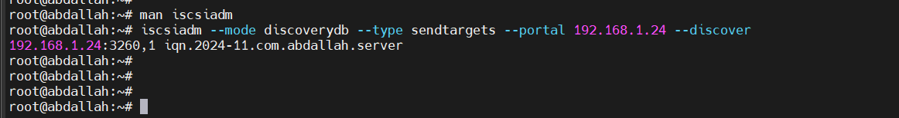

to access this storage we need to add the user name and password which we set in the server
just add these lines in the conf file 
```bash
root@abdallah:~# nano /etc/iscsi/iscsid.conf
```

node.session.auth.authmethod = CHAP
node.session.auth.username = username
node.session.auth.password = password

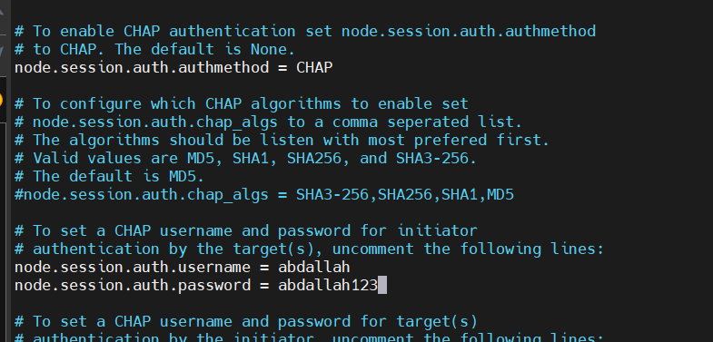

restart the iscsi service 
```bash
root@abdallah:~# service iscsi restart
```

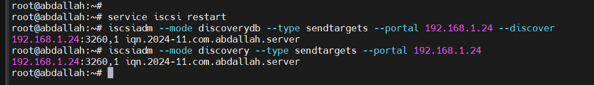

- **`discoverydb` mode**: Stores the discovered targets in the local iSCSI database, allowing for easier management and re-use of discovered targets in the future.
- **`discovery` mode**: Simply performs the discovery operation without storing the results persistently.

#### 2. Log In to the Target
- Once you have discovered the target, log in to it using the IQN of the target and the IP address.

```bash
root@abdallah:~#  iscsiadm --mode discoverydb --type sendtargets --portal 192.168.1.24 --discover
192.168.1.24:3260,1 iqn.2024-11.com.abdallah.server
root@abdallah:~# iscsiadm -m node -T iqn.2024-11.com.abdallah.server -p 192.168.1.24 --login
Logging in to [iface: default, target: iqn.2024-11.com.abdallah.server, portal: 192.168.1.24,3260]
Login to [iface: default, target: iqn.2024-11.com.abdallah.server, portal: 192.168.1.24,3260] successful.
```

this is the shared disk 
```bash
root@abdallah:~# lsblk /dev/sdd
NAME MAJ:MIN RM SIZE RO TYPE MOUNTPOINTS
sdd    8:48   0  10G  0 disk
```


we can mount it 
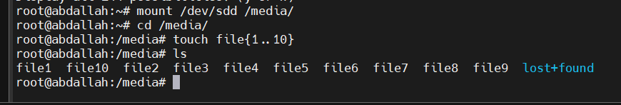

### let's create file backstores
1-create file with the size which you want 
```bash
root@server:~# dd if=/dev/zero of=/root/bigfile bs=1M count=5000
5000+0 records in
5000+0 records out
5242880000 bytes (5.2 GB, 4.9 GiB) copied, 3.99871 s, 1.3 GB/s
root@server:~# ls /root/bigfile -h
/root/bigfile
root@server:~# ls /root/bigfile -hl
-rw-r--r-- 1 root root 4.9G Nov  5 16:30 /root/bigfile
```

2-add it the the backstores 
```bash
/backstores/fileio> create
file_or_dev=  name=         size=         sparse=       write_back=   wwn=
/backstores/fileio> create file /root/bigfile
Created fileio file with size 5242880000

```

3-add the lun
```bash
/> cd iscsi/iqn.2024-11.com.abdallah.server/tpg1/luns/
/iscsi/iqn.20...ver/tpg1/luns> create /backstores/fileio/file
Created LUN 1.
Created LUN 1->1 mapping in node ACL iqn.2024-11.com.abdallah.client
```

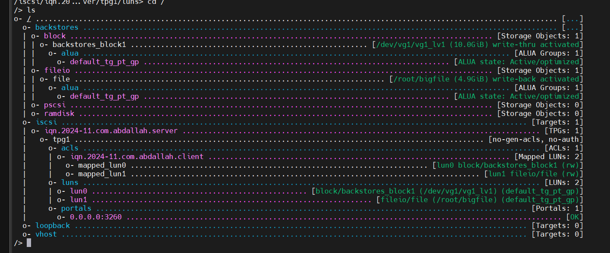


for the client logout and login again to see the updates 
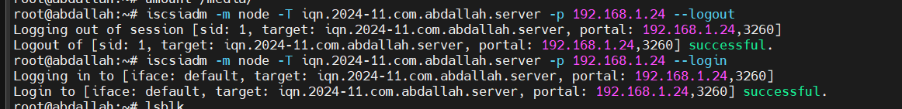

the file is sde

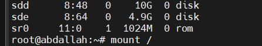


create the file system 
```bash
root@abdallah:~# mkfs.ext4 /dev/sde
mke2fs 1.46.5 (30-Dec-2021)
Creating filesystem with 1280000 4k blocks and 320000 inodes
Filesystem UUID: 202ade58-04ca-4c74-91ee-d9dea3cabf03
Superblock backups stored on blocks:
        32768, 98304, 163840, 229376, 294912, 819200, 884736

Allocating group tables: done
Writing inode tables: done
Creating journal (16384 blocks):
done
Writing superblocks and filesystem accounting information: done
```

now we can use it 

```bash
root@abdallah:~# mount /dev/sde /media/
root@abdallah:~# cd /media/
root@abdallah:/media# touch file{1..20}
root@abdallah:/media# ls
file1  file10  file11  file12  file13  file14  file15  file16  file17  file18  file19  file2  file20  file3  file4  file5  file6  file7  file8  file9  lost+found
root@abdallah:/media#

```

we can delete all the configuration
```bash
root@abdallah:~# iscsiadm -m node -T iqn.2024-11.com.abdallah.server -p 192.168.1.24 --logout
Logging out of session [sid: 2, target: iqn.2024-11.com.abdallah.server, portal: 192.168.1.24,3260]
Logout of [sid: 2, target: iqn.2024-11.com.abdallah.server, portal: 192.168.1.24,3260] successful.
root@abdallah:~# iscsiadm -m node -T iqn.2024-11.com.abdallah.server -p 192.168.1.24 -o delete
```


