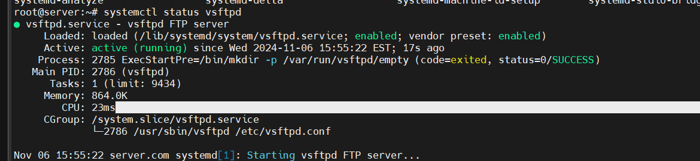
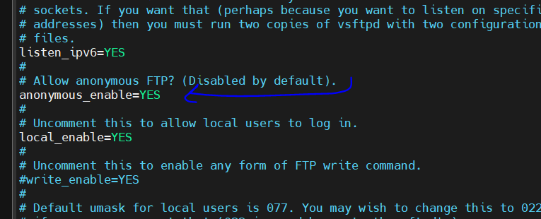
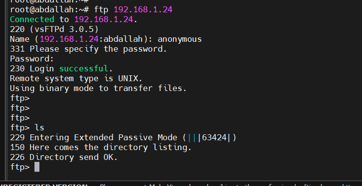
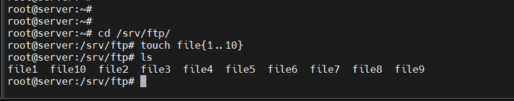
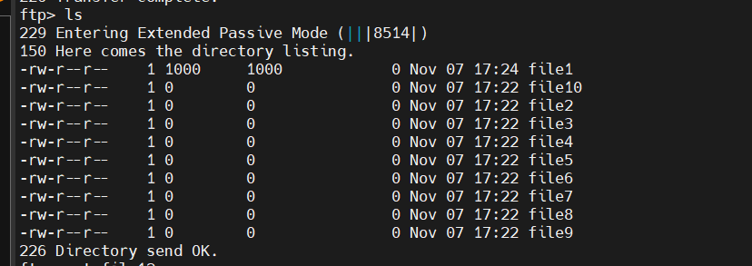
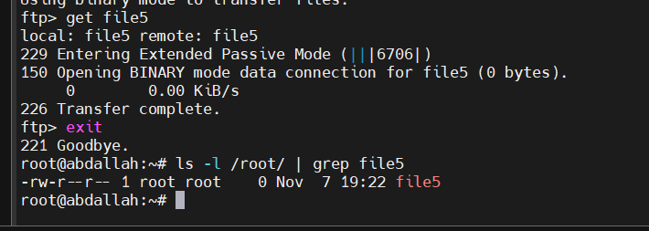
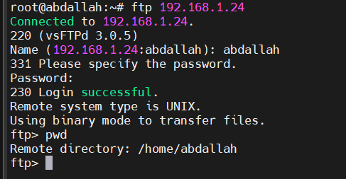
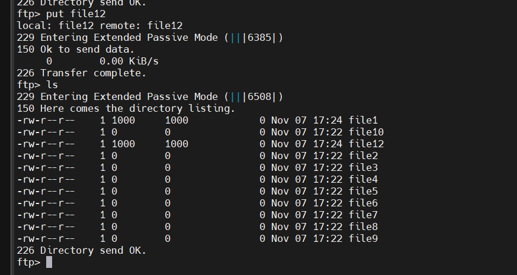

**FTP (file transfer protocol)** is an internet protocol that is used for transferring files between client and server over the internet or a computer network. It is similar to other internet protocols like SMTP which is used for emails and HTTP which is used for websites. **FTP server** enables the functionality of transferring files between server and client. A **client** connects to the **server** with credentials and depending upon the permissions it has, it can either read files or upload files to the server as well.

- **FTP Server**: The server hosts files and handles client requests for downloading or uploading.
- **FTP Client**: A software that connects to the FTP server to access or transfer files.

### Setting Up an FTP Server

To set up an FTP server on a Linux system, you can use popular FTP server software like **vsftpd** (Very Secure FTP Daemon).

#### Installing `vsftpd` FTP Server on Ubuntu/Debian

```bash
sudo apt update 
sudo apt install vsftpd -y
```

the service is p and running 



### Setting Up an FTP Client

To install a simple FTP client on Ubuntu/Debian:
```bash
sudo apt install ftp 
```

#### Connecting to an FTP Server Using `ftp`

Connect to the server:
```bash
ftp <server-ip>
```

first we will login as anonymous so this not required any username or password , to enable this anonymous login just edit the configuration in the server in /etc/vsftpd.conf and set the anonymous_enable=YES and restart the vsftpd service.


no we can login as anonymous



By default, an FTP client will access the **home directory** of the user account they log in with on the FTP server. For example:
- If a user logs in as `ftpuser`, the default directory they access will be `/home/ftpuser`.
- For anonymous FTP, the default directory is often `/srv/ftp` or `/var/ftp`, depending on the server configuration.
- or we can  will specify the default directory for FTP connections which will open when someone connects to our FTP server. Add the following line local_root=/ftp

in the server 



in the client 




Use FTP commands to interact with the server:

- `ls` – List files
- `get <filename>` – Download a file
- `put <filename>` – Upload a file
- `bye` – Exit the session

#### get command 




For local user access, ensure `local_enable=YES`.



to enable upload to ftp server 
just add write_enable=YES



