### what is loopback 127.0.0.1?
this is software interface to test tcp/ip stack and run local services  without needing the NIC (network interface card) like database mysql , apache,these service listen on interface and wait for connection from user .


### NetworkManager


if we have multiple place that give us different ip address and i need to connect to specific server , then when we want to connect to this server from any place , we need to know the ip , username , password and connect every time .
instad it the NetworkManager introduce the concept of profiles 
all we need now to create profile for every place , then we connect (up) or disconnet(down) the profiles according to the place  


**NetworkManager** provides a way to manage different network configurations conveniently, especially if you frequently connect to different networks, each with unique settings. NetworkManager allows you to create **profiles** for each network environment, which makes reconnecting easier without reconfiguring settings every time.

- **Profiles in NetworkManager** are essentially configurations for different network environments. Each profile can store:
    
    - **IP address settings** (static or dynamic)
    - **Authentication details** (like usernames, passwords, or certificates)
    - **Other network-specific settings** (such as DNS servers, routes, etc.)
- **Create Profiles**:
    - You can create separate profiles for different locations (e.g., work, home, coffee shop) using the NetworkManager GUI or the command line (`nmcli`).
- **Connect or Disconnect Profiles**:
    
    - Instead of manually setting the IP, DNS, or gateway for each connection, you simply activate (`nmcli connection up`) or deactivate (`nmcli connection down`) the relevant profile.

### to show all the network interface which you have 
```bash
root@abdallah:~# nmcli connection show
NAME                UUID                                  TYPE      DEVICE
Wired connection 1  b9a1ed67-6cdb-35e7-bd8a-32ac352661da  ethernet  enp0s3

```

### to show all the details for specific network interface 
```bash
root@abdallah:~# nmcli connection show Wired\ connection\ 1
connection.id:                          Wired connection 1
connection.uuid:                        b9a1ed67-6cdb-35e7-bd8a-32ac352661da
connection.stable-id:                   --
connection.type:                        802-3-ethernet
connection.interface-name:              enp0s3
connection.autoconnect:                 yes
connection.autoconnect-priority:        -999
connection.autoconnect-retries:         -1 (default)
connection.multi-connect:               0 (default)
connection.auth-retries:                -1
connection.timestamp:                   1727982854
connection.read-only:                   no
..........
......
..
.
.
```

### so we will delete this connect by using delete 
```bash
root@abdallah:~# nmcli connection delete Wired\ connection\ 1
Connection 'Wired connection 1' (b9a1ed67-6cdb-35e7-bd8a-32ac352661da) successfully deleted.
```

### lets create new one 

```bash
root@abdallah:~# nmcli connection add con-name home ifname enp0s3 type ethernet autoconnect yes
Connection 'home' (a7b70b8c-356d-40af-975b-3a49def 1adc6) successfully added.
root@abdallah:~#
root@abdallah:~#
root@abdallah:~# nmcli connection show
NAME  UUID                                  TYPE      DEVICE
home  36cb479d-569b-4882-9dd2-c41842c17275  ethernet  enp0s3
```

now the ip is taken from dhcp we can modify it to set static ip and edit all the configuration


```bash
root@abdallah:~# nmcli connection modify home ipv4.addresses 192.168.1.110/24 ipv4.gateway 192.168.1.2 ipv4.dns "8.8.8.8 8.8.4.4"
root@abdallah:~# nmcli connection show home
connection.id:                          home
connection.uuid:                        36cb479d-569b-4882-9dd2-c41842c17275
connection.stable-id:                   --
connection.type:                        802-3-ethernet
connection.interface-name:              enp0s3
connection.autoconnect:                 yes
.
.
.
.
ipv4.method:                            auto
ipv4.dns:                               8.8.8.8,8.8.4.4
ipv4.dns-search:                        --
ipv4.dns-options:                       --
ipv4.dns-priority:                      0
ipv4.addresses:                         192.168.1.110/24
ipv4.gateway:                           192.168.1.2
.
.
.
IP4.ADDRESS[1]:                         192.168.56.101/24
IP4.GATEWAY:                            --
IP4.ROUTE[1]:                           dst = 192.168.56.0/24, nh = 0.0.0.0, mt = 100
IP4.ROUTE[2]:                           dst = 169.254.0.0/16, nh = 0.0.0.0, mt = 1000
DHCP4.OPTION[1]:                        dhcp_lease_time = 600
DHCP4.OPTION[2]:                        dhcp_server_identifier = 192.168.56.100
DHCP4.OPTION[3]:                        expiry = 1727984171
DHCP4.OPTION[4]:                        ip_address = 192.168.56.101
```
no activated until now 
we can see that ipv4.method:  auto this mean that the machine will take an ip address from the dhcp 
and still the ip is the old one here IP4.ADDRESS[1]:  192.168.56.101/24.
we will set it to manual and we must deactivate and reactivate it again

```bash

root@abdallah:~# nmcli connection modify home ipv4.method manual
root@abdallah:~# nmcli connection
add      clone    delete   down     edit     export   help     import   load     modify   monitor  reload   show     up
root@abdallah:~# nmcli connection down home
root@abdallah:~# nmcli connection up home
```


[Internet Protocol version 4](https://tools.ietf.org/html/rfc791) (IPv4) is the fourth version of the standard that routes Internet traffic and other packet-switched networks introduced in 1982 by the [Internet Engineering Task Force](https://en.wikipedia.org/wiki/Internet_Engineering_Task_Force) (IETF). IPv4 is the most widely used version of the protocol despite the limitations of its 32-bit address space. With slightly less than 4.3 billion available unique addresses, the available number of addresses quickly began to run out. With some clever ingenuity over the years that extended the life of the protocol, the pool of available addresses didn’t dry up until 2011.


how the machine get the ip?
1-static --> manual
2-auuto --> from DHCP  
3-APIPA --> start from 169.254.x.x


APIPA used when the devices in layer 2 domain (connected only to servers) , it can take the ips from APIPA and can communicate with etch other.


### 1. **IPv6 Overview**

IPv6 is the successor to IPv4, designed to address the limitations of IPv4, primarily the shortage of IP addresses. IPv6 addresses are represented as eight groups of four hexadecimal digits, separated by colons, such as:


```ruby
`2001:0db8:85a3:0000:0000:8a2e:0370:7334`
```


Each group is a 16-bit block, making IPv6 addresses 128 bits long.

### 2. **Prefix `fe80` and Link-Local Addresses**

The prefix `fe80` is used to denote **link-local addresses** in IPv6. Link-local addresses are:

- Automatically configured addresses that are used for communication within a local network segment.
- Non-routable, meaning they cannot be used to communicate with nodes outside of the local link.
- Essential for network functions like neighbor discovery, address autoconfiguration, and when a device first joins a network.

Link-local addresses are always prefixed with `fe80::/10`, which means the first 10 bits are `1111 1110 10` (or `fe80` to `febf`), and the rest of the address is generated based on other factors, often involving the MAC address.

### 3. **IPv6 Shortening Rules**

IPv6 addresses can be quite long, but there are rules to **shorten** them to make them more manageable:

- **Leading Zeros**: Remove leading zeros in each block. For example, `0001` becomes `1`.
- **Consecutive Zeros**: Replace consecutive blocks of zeros with `::`. However, this can be used only once in an address to avoid ambiguity.

For instance:

```ruby
`2001:0db8:0000:0000:0000:ff00:0042:8329`
Can be shortened to:
`2001:db8::ff00:42:8329`
```

- In the above example, `::` replaces multiple blocks of consecutive zeros.
### 4. **Link-Local IPv6 Addresses (`fe80::/64`)**

- Link-local addresses are used for local communication within the same link or network segment.
- These addresses start with the prefix `fe80`, and the remaining 64 bits are typically derived from the network interface's MAC address.
- Example of a link-local address:
```ruby
    `fe80::1a2b:3c4d:5e6f:7a8b`
```
### 5. **Generate IPv6 Address from MAC Address**

To generate an IPv6 address from a MAC address using **Modified EUI-64**:

- The MAC address is 48 bits long and needs to be converted to fit into the 64-bit Interface Identifier of an IPv6 address.
- The steps involve:
    1. **Split the MAC Address**: Split the 48-bit MAC address into two 24-bit halves.
    2. **Insert `fffe`**: Insert the value `fffe` between the two halves to make it 64 bits.
    3. **Invert the 7th Bit**: Invert the Universal/Local (U/L) bit, which is the 7th bit of the first byte of the MAC address.

#### Example:

Consider a MAC address `52:74:f2:b1:a8:7f`:

Link-local IPv6 addresses are used as part of the IPv6 network auto-configuration process. Instead of getting an address via DHCP, a NIC will hop on the network with a link-local IPv6 address and with this will have to ability to do further configuration automatically (soliciting neighbors, router, et cetera).

This link-local IPv6 is infered from the NIC’s mac address.

A mac address is 48 bits, an IPv6 address is 128 bits. Here’s the conversion process step by step:

1. take the mac address: for example 52:74:f2:b1:a8:7f
2. throw ff:fe in the middle: 52:74:f2:**ff:fe**:b1:a8:7f
3. reformat to IPv6 notation 5274:f2ff:feb1:a87f
4. convert the first octet from hexadecimal to binary: **52** -> **01010010**
5. invert the bit at index 6 (counting from 0): **01010010** -> **01010000**
6. convert octet back to hexadecimal: **01010000** -> **50**
7. replace first octet with newly calculated one: **50**74:f2ff:feb1:a87f
8. prepend the link-local prefix: **fe80::**5074:f2ff:feb1:a87f
Note the `fe80` prefix, indicating it is a link-local address.

after step number six this ip call EUI or EUI-64 (**Extended Unique Identifier**) .
EUI-64 = 5074:f2ff:feb1:a87f
### 6. **Use Cases of Link-Local Addresses**

- **Neighbor Discovery Protocol (NDP)**: IPv6 devices use link-local addresses for NDP, which replaces ARP in IPv4.
- **Router Advertisement**: Routers use link-local addresses to send router advertisements, allowing devices to configure their IPv6 addresses automatically.

### Summary

- **Link-Local IPv6 Addresses**: Always start with the prefix `fe80::/10`, used for communication within the local link.
- **Shortening Rules**: Remove leading zeros and use `::` to replace consecutive zero blocks.
- **Generating IPv6 from MAC Address**: Uses Modified EUI-64, where `fffe` is inserted and the U/L bit is inverted to create the Interface Identifier.

if we have router or more then every network connected to this routers can communicate with etch other by using site local because in the link local the router will drop or discard (not routed)
so the sharing networks that uses the routers used the site local and the prefix is  FEC0::/10.


### 1. **Link-Local Addresses (`fe80::/10`)**

- **Scope**: Link-local addresses are used for communication between devices on the same local link (network segment or subnet).
- **Prefix**: Always start with `fe80::/10`. This means the first 10 bits are fixed as `1111 1110 10`.
- **Purpose**: Primarily used for network activities that do not require routing, such as **Neighbor Discovery**, **Address Autoconfiguration**, and **Routing Information Exchange**. Link-local addresses are automatically configured for every IPv6-enabled interface.
- **Connectivity**: These addresses can only communicate within the same link and are **non-routable** beyond that link. If a device on a link sends a packet to another device on the same link, it uses the link-local address.
- **Automatic Configuration**: Link-local addresses are configured automatically, even if no global or unique local address is assigned.
- **Example**:
```ruby
`fe80::1a2b:3c4d:5e6f:7a8b`
```


### 2. **Site-Local Addresses (`fec0::/10`) [Deprecated]**

- **Scope**: Site-local addresses were used for communication within an entire site (e.g., an organization's internal network). They were somewhat similar to IPv4 private addresses (like `192.168.x.x` or `10.x.x.x`).
- **Prefix**: Site-local addresses started with `fec0::/10`, meaning the first 10 bits were `1111 1110 11`.
- **Purpose**: Intended for use within a local site to facilitate communication across multiple subnets, but not routable on the public internet. They allowed for internal communication across a broader area than link-local.
- **Deprecation**: Site-local addresses were deprecated by the IETF (Internet Engineering Task Force) in RFC 3879 due to issues with address ambiguity when multiple sites were interconnected. They were replaced by **Unique Local Addresses (ULAs)**.
- **Replacement**: ULAs (`fc00::/7`) are used instead of site-local addresses to provide a clear distinction between globally unique addresses and local (private) addresses.
- **Example** (deprecated):
```ruby
`fec0::1a2b:3c4d:5e6f:7a8b`
```

### 3. **Unique Local Addresses (ULAs) (`fc00::/7`)**

- **Replacement for Site-Local**: ULAs were introduced as a replacement for site-local addresses. They function similarly to IPv4 private addresses and are used for communication within a private network.
- **Prefix**: ULAs start with `fc00::/7`, which includes `fc00::` and `fd00::` prefixes.
- **Purpose**: ULAs are used for devices that need a permanent, unique local address, similar to IPv4 private addresses, but not intended to be routable on the public internet.
- **Example**:
```ruby
`fd00::1a2b:3c4d:5e6f:7a8b`
```

### Summary of Differences

|Feature|Link-Local (`fe80::/10`)|Site-Local (`fec0::/10`) (Deprecated)|Unique Local (`fc00::/7`)|
|---|---|---|---|
|**Scope**|Single link|Entire site (deprecated)|Local network (private)|
|**Prefix**|`fe80::/10`|`fec0::/10`|`fc00::/7`|
|**Purpose**|Local link communication|Local site communication|Private internal use|
|**Routability**|Not routable|Not routable (deprecated)|Not globally routable|
|**Configuration**|Automatically assigned|Manually assigned (deprecated)|Manually or automatically|
|**Current Usage**|Yes|No (deprecated)|Yes|
In short, **link-local** addresses are for immediate network segments (local link), **site-local** addresses were for internal site use (but deprecated), and **Unique Local Addresses (ULAs)** are now used for private internal addressing, similar to the role of IPv4 private addresses.


### multicast
IPv6 multicast addresses are in the range of addresses starting with the prefix `ff00::/8`. This means that all multicast addresses begin with `ff`.

so if we have a network contains 5 routers and 20 pc and send with the multicast address ff00::/8 
only the routers can accept this message because the pcs doesn't configure to listen in multicast address .

there are a special multicast address ff02::1  in this address all the routers and pcs replay 
this ipv6 address similar to broadcast but it is a multicast . this is used for network discovery.

### SLAAC 
**Stateless Address Autoconfiguration (SLAAC)** is a mechanism in IPv6 that allows devices to automatically configure their own IP addresses without the need for a server (like a DHCP server). With SLAAC, IPv6-enabled devices can generate a unique IPv6 address using information obtained from the local router and their own interface identifier, often derived from the device's hardware address. Here's an overview of the SLAAC discovery process and how the IPv6 address is generated:

### **1. SLAAC Discovery Process**

The SLAAC discovery process involves communication between the device (host) and a local router. Here’s how it works step by step:

#### **Step 1: Router Solicitation (RS)**

- When a device first connects to a network, it sends a **Router Solicitation (RS)** message to all routers on the local link. This message is sent to the **all-routers multicast address** (`ff02::2`) to discover any available IPv6 routers.
- The RS message asks routers to provide information necessary for the device to configure its network settings.

#### **Step 2: Router Advertisement (RA)**

- In response, the routers send a **Router Advertisement (RA)** message. This message is usually sent to the **all-nodes multicast address** (`ff02::1`) or directly to the device that requested it.
- The RA message contains important information, including:
    - The **network prefix** to be used by devices on the link (e.g., `2001:db8::/64`).
    - Flags indicating whether the device should use SLAAC, DHCPv6, or both.
    - The **lifetime** of the address and additional network settings, such as the default gateway.


#### **Step 3: Configuring the IPv6 Address**

- The device uses the **prefix** provided by the RA message along with its **interface identifier** to create a **global unicast address**. The resulting IPv6 address is unique and routable across the network.


#### **Step 1: Obtain the Network Prefix**

- The RA message includes a network prefix, such as `2001:db8:abcd::/64`. This prefix is used as the **first 64 bits** of the IPv6 address.

#### **Step 2: Deriving the Interface Identifier (Using EUI-64)**

- The **Interface Identifier** makes up the **last 64 bits** of the IPv6 address.
- The Interface Identifier is derived from the device’s **MAC address** (48 bits) using a process called **EUI-64**. Here's how it works:
    1. **Split the MAC Address**: The 48-bit MAC address (e.g., `aa:bb:cc:dd:ee:ff`) is split into two 24-bit halves: `aa:bb:cc` and `dd:ee:ff`.
    2. **Insert FFFE in the Middle**: Insert `FF:FE` between the two halves to create a 64-bit value: `aa:bb:cc:ff:fe:dd:ee:ff`.
    3. **Flip the Universal/Local (U/L) Bit**: The **seventh bit** (from the left) of the first byte is flipped. This bit indicates whether the address is universally or locally administered.
        - If the seventh bit is `0`, it’s a **universally unique** MAC address.
        - If the seventh bit is `1`, it indicates that the address is **locally administered**.
    4. **Final Interface Identifier**: After flipping the bit, you get the 64-bit **Interface Identifier**.

#### **tep 3: Combine Prefix and Interface Identifier**

- The final IPv6 address is formed by combining the **network prefix** with the **Interface Identifier**.
- For example, if the RA provides the prefix `2001:db8:abcd::/64`, and the device generates an Interface Identifier of `aabb:ccff:fedd:eeff`, the resulting IPv6 address will be:
    
```ruby
`2001:db8:abcd:aabb:ccff:fedd:eeff`
```


### route table

```
root@abdallah:~# route -n
Destination     Gateway         Genmask         Flags Metric Ref    Use Iface
0.0.0.0         192.168.1.1     0.0.0.0         UG    100    0        0 enp0s3
169.254.0.0     0.0.0.0         255.255.0.0     U     1000   0        0 enp0s3
192.168.1.0     0.0.0.0         255.255.255.0   U     100    0        0 enp0s3
```

```
root@abdallah:~# ip route add 8.8.8.8/32 via 192.168.1.1
root@abdallah:~# route -n
Kernel IP routing table
Destination     Gateway         Genmask         Flags Metric Ref    Use Iface
0.0.0.0         192.168.1.1     0.0.0.0         UG    100    0        0 enp0s3
8.8.8.8         192.168.1.1     255.255.255.255 UGH   0      0        0 enp0s3
169.254.0.0     0.0.0.0         255.255.0.0     U     1000   0        0 enp0s3
192.168.1.0     0.0.0.0         255.255.255.0   U     100    0        0 enp0s3

```

if the Destination is 8.8.8.8  now , the Gateway is 192.168.1.1

we can delete the specific routing road
```
root@abdallah:~# ip route del 8.8.8.8/32 via 192.168.1.1
root@abdallah:~# route -n
Kernel IP routing table
Destination     Gateway         Genmask         Flags Metric Ref    Use Iface
0.0.0.0         192.168.1.1     0.0.0.0         UG    100    0        0 enp0s3
169.254.0.0     0.0.0.0         255.255.0.0     U     1000   0        0 enp0s3
192.168.1.0     0.0.0.0         255.255.255.0   U     100    0        0 enp0s3
```

default Gateway 
```
root@abdallah:~# route -n
Kernel IP routing table
Destination     Gateway         Genmask         Flags Metric Ref    Use Iface
169.254.0.0     0.0.0.0         255.255.0.0     U     1000   0        0 enp0s3
192.168.1.0     0.0.0.0         255.255.255.0   U     100    0        0 enp0s3
root@abdallah:~# route add default gw 192.168.1.1
root@abdallah:~# route -n
Kernel IP routing table
Destination     Gateway         Genmask         Flags Metric Ref    Use Iface
0.0.0.0         192.168.1.1     0.0.0.0         UG    0      0        0 enp0s3
169.254.0.0     0.0.0.0         255.255.0.0     U     1000   0        0 enp0s3
192.168.1.0     0.0.0.0         255.255.255.0   U     100    0        0 enp0s3

```
any unknown Destination , the  Gateway is   192.168.1.1 

we can add more than one routing 
for example if the netmask is 10.0.0.0 the Gateway is 192.168.1.150
anything else , the Gateway is 192.168.1.1
```
root@abdallah:~# ip route add 10.0.0.0/24 via 192.168.1.150
root@abdallah:~# route -n
Kernel IP routing table
Destination     Gateway         Genmask         Flags Metric Ref    Use Iface
0.0.0.0         192.168.1.1     0.0.0.0         UG    0      0        0 enp0s3
10.0.0.0        192.168.1.150   255.255.255.0   UG    0      0        0 enp0s3
```


### DNS(nameserver)

The Domain Name System (DNS) is the phonebook of the Internet. Humans access information online through [domain names](https://www.cloudflare.com/learning/dns/glossary/what-is-a-domain-name/), like nytimes.com or espn.com. Web browsers interact through [Internet Protocol (IP)](https://www.cloudflare.com/learning/network-layer/internet-protocol/) addresses. DNS translates domain names to [IP addresses](https://www.cloudflare.com/learning/dns/glossary/what-is-my-ip-address/) so browsers can load Internet resources.

Each device connected to the Internet has a unique IP address which other machines use to find the device. DNS servers eliminate the need for humans to memorize IP addresses such as 192.168.1.1 (in IPv4), or more complex newer alphanumeric IP addresses such as 2400:cb00:2048:1::c629:d7a2 (in IPv6).


how to add dns ?
we can add any popular dns like google dns (8.8.8.8) by editing the /etc/resol.conf file and add this dns

```
root@abdallah:~# nano /etc/resolv.conf
#add the follwing lines 
nameserver 8.8.8.8
nameserver 8.8.4.4
```

or we can add by using NetworkManager 
```
root@abdallah:~# nmcli connection modify <connection-name> ipv4.dns "8.8.8.8 8.8.4.4"
root@abdallah:~# nmcli connection up <connection-name>
```

When you configure multiple nameservers in the `/etc/resolv.conf` file, the operating system will attempt to use them in the order they are listed. Here’s how it works:

1. **Primary Nameserver**: The first nameserver listed in `/etc/resolv.conf` is treated as the primary DNS server. The system will attempt to send DNS queries to this server first.
    
2. **Timeout**: If the primary nameserver does not respond within a predefined timeout period (typically a few seconds), the operating system will give up on that request.
    
3. **Fallback to Secondary Nameserver**: After the timeout, the system will move on to the next nameserver listed in the file and attempt to resolve the DNS query using that server.
    
4. **Continues Until Resolved or Exhausted**: This process continues until a response is received from one of the nameservers or until all configured nameservers have been tried. If none of the nameservers respond, the DNS resolution fails.

```
nameserver 8.8.8.8    # Google DNS
nameserver 8.8.4.4    # Google DNS (secondary)
nameserver 1.1.1.1    # Cloudflare DNS
nameserver 208.67.222.222  # OpenDNS
```


we can make it manual also if the number of machines is little like (5 ... 10 )
by using the file /etc/hosts

```
root@abdallah:~# nano /etc/hosts
127.0.0.1       localhost
127.0.1.1       abdallah

# The following lines are desirable for IPv6 capable hosts
::1     ip6-localhost ip6-loopback
fe00::0 ip6-localnet
ff00::0 ip6-mcastprefix
ff02::1 ip6-allnodes
ff02::2 ip6-allrouters
```

we can ping on localhost or abdallah
```
root@abdallah:~# ping localhost
PING localhost (127.0.0.1) 56(84) bytes of data.
64 bytes from localhost (127.0.0.1): icmp_seq=1 ttl=64 time=0.019 ms
64 bytes from localhost (127.0.0.1): icmp_seq=2 ttl=64 time=0.084 ms

--- localhost ping statistics ---
2 packets transmitted, 2 received, 0% packet loss, time 1041ms
rtt min/avg/max/mdev = 0.019/0.051/0.084/0.032 ms
root@abdallah:~# ping abdallah
PING abdallah (127.0.1.1) 56(84) bytes of data.
64 bytes from abdallah (127.0.1.1): icmp_seq=1 ttl=64 time=0.018 ms
64 bytes from abdallah (127.0.1.1): icmp_seq=2 ttl=64 time=0.070 ms
64 bytes from abdallah (127.0.1.1): icmp_seq=3 ttl=64 time=0.069 ms

--- abdallah ping statistics ---
3 packets transmitted, 3 received, 0% packet loss, time 2061ms
rtt min/avg/max/mdev = 0.018/0.052/0.070/0.024 ms
```

for ipv6 
```
root@abdallah:~# ping6 ip6-localhost
PING ip6-localhost(ip6-localhost (::1)) 56 data bytes
64 bytes from ip6-localhost (::1): icmp_seq=1 ttl=64 time=0.091 ms
64 bytes from ip6-localhost (::1): icmp_seq=2 ttl=64 time=0.285 ms

--- ip6-localhost ping statistics ---
2 packets transmitted, 2 received, 0% packet loss, time 1040ms
rtt min/avg/max/mdev = 0.091/0.188/0.285/0.097 ms
root@abdallah:~# ping6 ip6-loopback
PING ip6-loopback(ip6-localhost (::1)) 56 data bytes
64 bytes from ip6-localhost (::1): icmp_seq=1 ttl=64 time=0.026 ms
64 bytes from ip6-localhost (::1): icmp_seq=2 ttl=64 time=0.023 ms

--- ip6-loopback ping statistics ---
2 packets transmitted, 2 received, 0% packet loss, time 1051ms

```

note that we can add more than one name  like  ::1     ip6-localhost ip6-loopback

```
root@abdallah:~# nano /etc/hosts
127.0.0.1       localhost
127.0.1.1       abdallah

# The following lines are desirable for IPv6 capable hosts
::1     ip6-localhost ip6-loopback
fe00::0 ip6-localnet
ff00::0 ip6-mcastprefix
ff02::1 ip6-allnodes
ff02::2 ip6-allrouters


# add name for google ip
142.250.200.206 ping_google

root@abdallah:~# ping ping_google
PING ping_google (142.250.200.206) 56(84) bytes of data.
64 bytes from ping_google (142.250.200.206): icmp_seq=1 ttl=117 time=48.9 ms
64 bytes from ping_google (142.250.200.206): icmp_seq=2 ttl=117 time=48.5 ms
64 bytes from ping_google (142.250.200.206): icmp_seq=3 ttl=117 time=48.7 ms
```


now we have two files resolv and hosts , what is he first file to alook at ?
if we open another file /etc/nsswitch.conf and look at the hosts line assigned with files , dns
```
root@abdallah:~# nano /etc/nsswitch.conf

# /etc/nsswitch.conf
#
# Example configuration of GNU Name Service Switch functionality.
# If you have the `glibc-doc-reference' and `info' packages installed, try:
# `info libc "Name Service Switch"' for information about this file.

passwd:         files systemd
group:          files systemd
shadow:         files
gshadow:        files

hosts:          files mdns4_minimal [NOTFOUND=return] dns
networks:       files

protocols:      db files
services:       db files
ethers:         db files
rpc:            db files

netgroup:       nis
```

files --> will look at hosts
dns --> will look at resolv.conf
if we remove this line , now we can't resolves hostnames to IP addresses (hosts file) and we can't use the dns for resolving.


the prolem here when we reboot the machine all the configuration is lost like routing table , resolve (may , or may not , ...) it's better to always use  the network manager    to add or remove any configuration to the netweork

```
root@abdallah:~# nmcli connection modify static-ip +ipv4.dns 8.8.8.8
root@abdallah:~# nmcli connection modify static-ip +ipv4.dns 8.8.4.4
```
for removing we can use minus
```
root@abdallah:~# nmcli connection modify static-ip -ipv4.dns 8.8.8.8
root@abdallah:~# nmcli connection modify static-ip -ipv4.dns 8.8.4.4
```

### search in resolv.conf


The `search` directive in the `/etc/resolv.conf` file is used to define a list of domain names that the system will automatically append to unqualified hostnames during DNS resolution. This is particularly useful in environments where many hosts share a common domain suffix.


```

root@abdallah:~# nmcli connection modify static-ip ipv4.dns-search abdallah.com
root@abdallah:~# systemctl restart NetworkManager
root@abdallah:~# cat /etc/resolv.conf

# This is /run/systemd/resolve/stub-resolv.conf managed by man:systemd-resolved(8).
# Do not edit.
#
# This file might be symlinked as /etc/resolv.conf. If you're looking at
# /etc/resolv.conf and seeing this text, you have followed the symlink.
#
# This is a dynamic resolv.conf file for connecting local clients to the
# internal DNS stub resolver of systemd-resolved. This file lists all
# configured search domains.
#
# Run "resolvectl status" to see details about the uplink DNS servers
# currently in use.
#
# Third party programs should typically not access this file directly, but only
# through the symlink at /etc/resolv.conf. To manage man:resolv.conf(5) in a
# different way, replace this symlink by a static file or a different symlink.
#
# See man:systemd-resolved.service(8) for details about the supported modes of
# operation for /etc/resolv.conf.

nameserver 127.0.0.53
options edns0 trust-ad
search abdallah.com

```
automatically add the search search abdallah.com

```
root@abdallah:~# nmcli connection modify static-ip +ipv4.dns-search test.com
root@abdallah:~# cat /etc/resolv.conf
# This is /run/systemd/resolve/stub-resolv.conf managed by man:systemd-resolved(8).
# Do not edit.
#
# This file might be symlinked as /etc/resolv.conf. If you're looking at
# /etc/resolv.conf and seeing this text, you have followed the symlink.
#
# This is a dynamic resolv.conf file for connecting local clients to the
# internal DNS stub resolver of systemd-resolved. This file lists all
# configured search domains.
#
# Run "resolvectl status" to see details about the uplink DNS servers
# currently in use.
#
# Third party programs should typically not access this file directly, but only
# through the symlink at /etc/resolv.conf. To manage man:resolv.conf(5) in a
# different way, replace this symlink by a static file or a different symlink.
#
# See man:systemd-resolved.service(8) for details about the supported modes of
# operation for /etc/resolv.conf.

nameserver 127.0.0.53
options edns0 trust-ad
search abdallah.com test.com
```

then i added these lines in /etc/hosts for testing 
```
root@abdallah:~# cat /etc/hosts
127.0.0.1       localhost
127.0.1.1       abdallah

# The following lines are desirable for IPv6 capable hosts
::1     ip6-localhost ip6-loopback
fe00::0 ip6-localnet
ff00::0 ip6-mcastprefix
ff02::1 ip6-allnodes
ff02::2 ip6-allrouters


# for test ---> added by me
142.250.200.206 ping_google

192.168.1.1   gw.abdallah.com
142.250.200.206 google.abdallah.com
127.0.0.1 localhost.abdallah.com
root@abdallah:~#
root@abdallah:~# ping google
PING google.abdallah.com (142.250.200.206) 56(84) bytes of data.
64 bytes from ping_google (142.250.200.206): icmp_seq=1 ttl=117 time=49.4 ms
64 bytes from ping_google (142.250.200.206): icmp_seq=2 ttl=117 time=49.9 ms
64 bytes from ping_google (142.250.200.206): icmp_seq=3 ttl=117 time=49.6 ms

--- google.abdallah.com ping statistics ---
3 packets transmitted, 3 received, 0% packet loss, time 2011ms
rtt min/avg/max/mdev = 49.356/49.620/49.880/0.213 ms
root@abdallah:~# ping gw
PING gw.abdallah.com (192.168.1.1) 56(84) bytes of data.
64 bytes from gw.abdallah.com (192.168.1.1): icmp_seq=1 ttl=64 time=2.21 ms
64 bytes from gw.abdallah.com (192.168.1.1): icmp_seq=2 ttl=64 time=2.04 ms
64 bytes from gw.abdallah.com (192.168.1.1): icmp_seq=3 ttl=64 time=2.96 ms
```


### Etherchannel
EtherChannel is a technology that allows the bundling of multiple physical Ethernet links into a single logical link to increase bandwidth, provide redundancy, and improve fault tolerance between network devices such as switches, routers, and servers. It helps in optimizing network performance by allowing the use of multiple links as if they were a single connection. If one of the physical links in the bundle fails, traffic will continue to flow over the remaining links, providing fault tolerance.

### **How EtherChannel Works**

EtherChannel operates by aggregating several Ethernet interfaces into one logical interface, and all member ports share the same characteristics such as speed and duplex. It is used to increase the overall network bandwidth and provide redundancy without needing to increase the number of interfaces or configure additional routing protocols.

### EtherChannel types :
1. PAgP: It is a Cisco-proprietary protocol.
2. LACP: IEEE Standard Protocol.
3. Manual: It is manually configured on each switch.


"Round Robin" and "Active Backup" refer to load balancing and failover strategies in networking, particularly in link aggregation, NIC bonding, or teaming setups. These methods are used to manage traffic distribution across multiple network interfaces and ensure redundancy in case of failures. Here's a detailed look at each:

### **1. Round Robin (Load Balancing)**

**Round Robin** is a load-balancing mode used in network link aggregation (also called NIC teaming or bonding) where traffic is distributed evenly across all available interfaces in a sequential order. This means that packets are sent over each interface in turn, creating an even distribution of traffic across the interfaces.

#### **How It Works:**

- The network traffic is sent in a cyclic manner, with each packet being transmitted over the next available interface.
- For example, if you have two NICs (NIC1 and NIC2) bonded, packets will be transmitted in the following order:
    - Packet 1 → NIC1
    - Packet 2 → NIC2
    - Packet 3 → NIC1
    - Packet 4 → NIC2
    - And so on...

### **2. Active Backup (Failover)**

**Active Backup** is a redundancy-focused failover mode, where only one network interface (NIC) is active at a time, and the others are in standby mode. If the active NIC fails, one of the backup NICs will take over, ensuring continuous network connectivity.

#### **How It Works:**

- Only one NIC is used to send and receive traffic at any given time.
- If the active NIC fails or loses its link, one of the backup NICs will immediately become active, ensuring seamless failover.
- The failover is automatic, meaning that no manual intervention is needed when a failure occurs.

### **NIC Teaming**

NIC teaming, also known as network interface card bonding or link aggregation, is a technology that combines multiple physical NICs (Network Interface Cards) into a single logical interface. The goal is to provide fault tolerance (if one NIC fails, the others take over) and load balancing (distribute network traffic across all NICs). NIC teaming can be used in servers, computers, and other network devices.

### implementation 
1-add virtual NIC into your virtual machine in this case i add four 
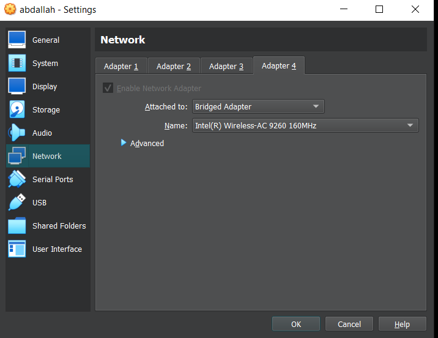

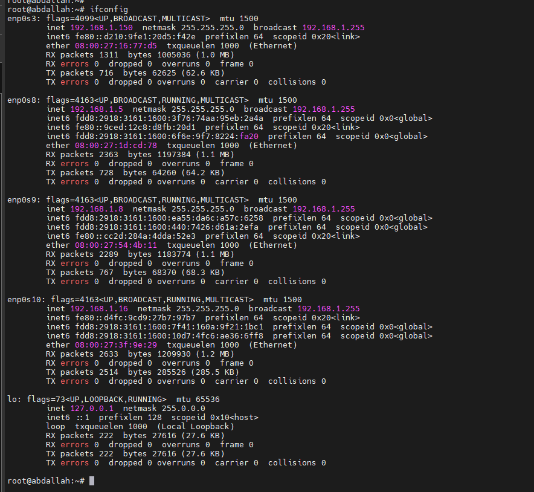

now we have only this connection
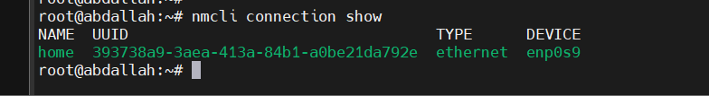

1-add team device (master)
```
root@abdallah:~# nmcli connection add con-name team0 type team ifname team config '{"runner":{"name":"activebackup"}}'
```
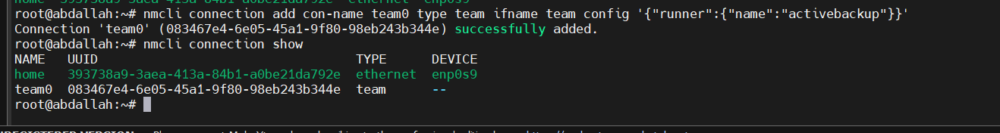

2-add the slaves
```
root@abdallah:~# nmcli connection add type team-slave ifname enp0s8 con-name team0-slave0 master team0
Connection 'team0-slave0' (be12b699-7d3a-4298-823c-09b02d0a2f49) successfully added.
root@abdallah:~# nmcli connection add type team-slave ifname enp0s10 con-name team0-slave1 master team0
Connection 'team0-slave1' (a0c0f999-05b3-4894-9d42-b29d3530ea2f) successfully added.
```
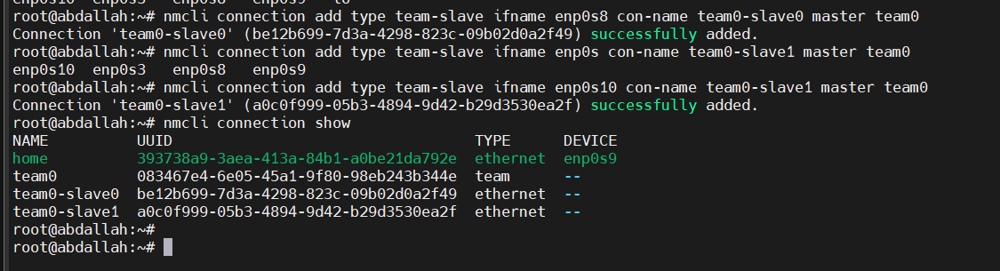
3-set static ip for the team
```
root@abdallah:~# nmcli connection modify team0 ipv4.addresses 192.168.1.150/24 ipv4.method manual
```
4-active the connection
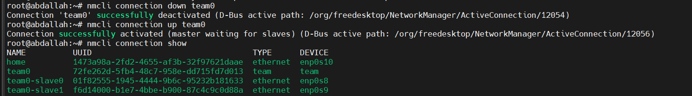

5-use teamdctl command to show your connections
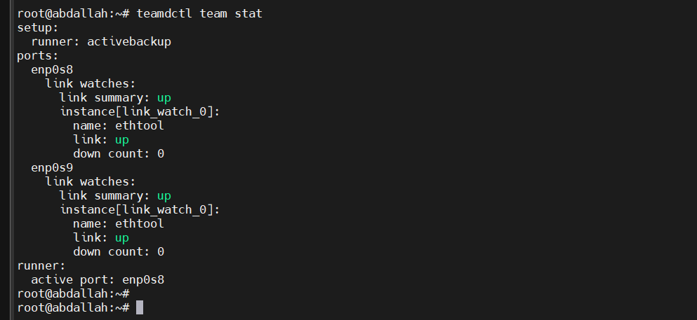

we have two ports in the team , the mode is activebackup , both ports are up and the active now is enp0s8.


6-testing
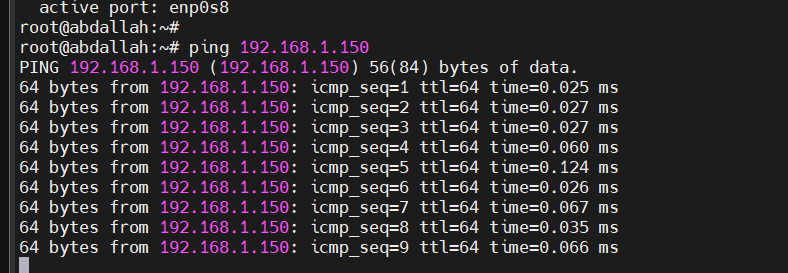
the ping is work

if we down one of both connections , we can ping also and the active one now is the second one enp0s9 
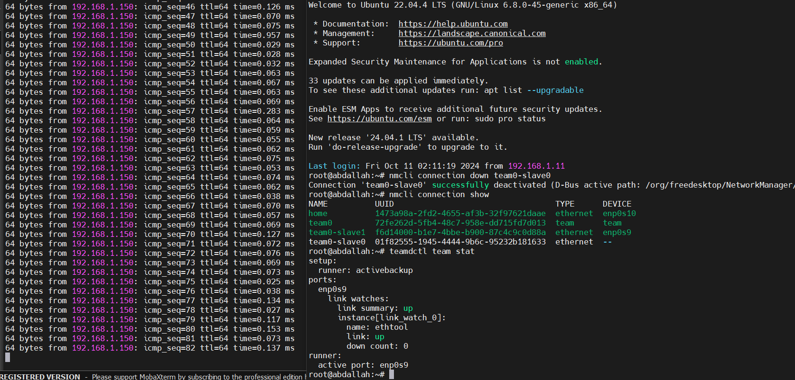


7-teamdctl
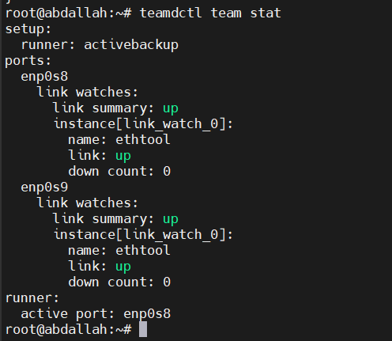


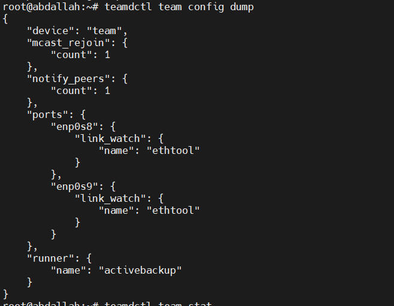
8- teamnl
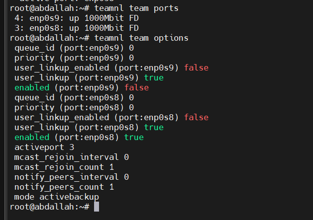

by using the teamnl tool we can change the priorities
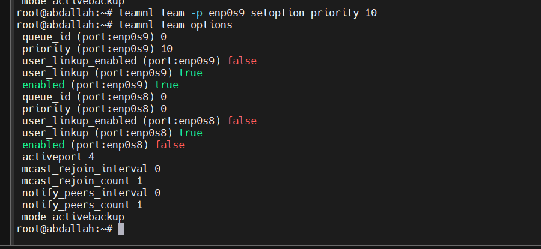

now the active port is the highest priority one 

### bridge
A **bridge** is a network device or a software implementation that connects and filters traffic between two or more network segments, effectively creating a single network. It's used to extend networks by allowing devices on separate network segments to communicate as if they were on the same physical network. In terms of the OSI (Open Systems Interconnection) model, a bridge operates at the **Data Link Layer (Layer 2)**, meaning it uses MAC addresses to forward traffic rather than IP addresses.

1-addin the bridge interface 
```
root@abdallah:~# nmcli connection add type bridge con-name br0 ifname br0
Connection 'br0' (8130db2f-62c3-4dcb-98f9-3e59257f7bcf) successfully added.

```

2-add the bridge slave
```
root@abdallah:~# nmcli connection add type bridge-slave ifname enp0s3 con-name br0-slave0 master br0
Connection 'br0-slave0' (316fd150-d2b5-41ef-bba1-ca1614441ecf) successfully added.

```

3-up the bridge interface
```
root@abdallah:~# nmcli connection down br0
Connection 'br0' successfully deactivated (D-Bus active path: /org/freedesktop/NetworkManager/ActiveConnection/12066)
root@abdallah:~# nmcli connection up br0
Connection successfully activated (master waiting for slaves) (D-Bus active path: /org/freedesktop/NetworkManager/ActiveConnection/12068)
root@abdallah:~# nmcli connection show
NAME          UUID                                  TYPE      DEVICE
home          1473a98a-2fd2-4655-af3b-32f97621daae  ethernet  enp0s10
team0         72fe262d-5fb4-48c7-958e-dd715fd7d013  team      team
br0           8130db2f-62c3-4dcb-98f9-3e59257f7bcf  bridge    br0
br0-slave0    316fd150-d2b5-41ef-bba1-ca1614441ecf  ethernet  enp0s3
team0-slave0  01f82555-1945-4444-9b6c-95232b181633  ethernet  enp0s8
team0-slave1  f6d14000-b1e7-4bbe-b900-87c4c9c0d88a  ethernet  enp0s9
```
4-testing 

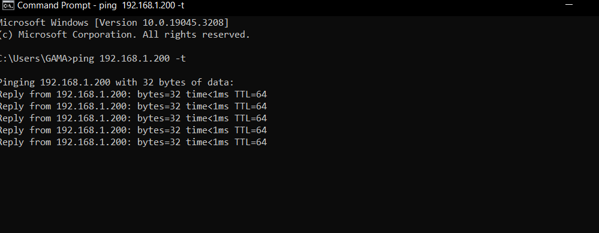

5-brctl
```

root@abdallah:~# brctl show
bridge name     bridge id               STP enabled     interfaces
br0             8000.1ea585d01081       yes             enp0s3
root@abdallah:~#

```


### we can use nmtui tool for adding any profile 
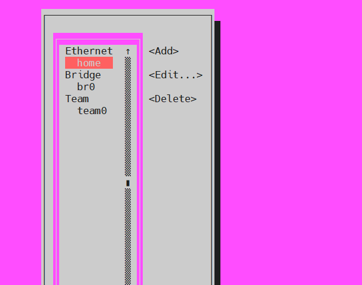


