RAID (redundant array of independent disks) is **a way of storing the same data in different places on multiple hard disks or solid-state drives (SSDs) to protect data in the case of a drive failure**. There are different RAID levels, however, and not all have the goal of providing redundancy.


### How RAID Works?
 It splits your data across multiple drives, so if one drive fails, your data is still safe on the others. RAID helps keep your information secure, just like spreading your favorite book among friends keeps it safe.
### What is a RAID Controller?
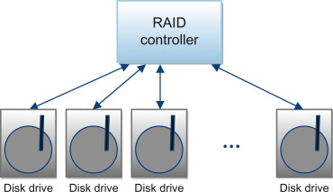

A RAID controller is like a boss for your hard drives in a big storage system. It works between your computer’s operating system and the actual hard drives, organizing them into groups to make them easier to manage. This helps speed up how fast your computer can read and write data, and it also adds a layer of protection in case one of your hard drives breaks down. So, it’s like having a smart helper that makes your hard drives work better and keeps your important data safer.

### Types of RAID Controller

**1-Hardware Based:**
In hardware-based RAID, there’s a physical controller that manages the whole array. This controller can handle the whole group of hard drives together. It’s designed to work with different types of hard drives, like SATA (Serial Advanced Technology Attachment) or SCSI (Small Computer System Interface). Sometimes, this controller is built right into the computer’s main board, making it easier to set up and manage your RAID system. It’s like having a captain for your team of hard drives, making sure they work together smoothly****.****
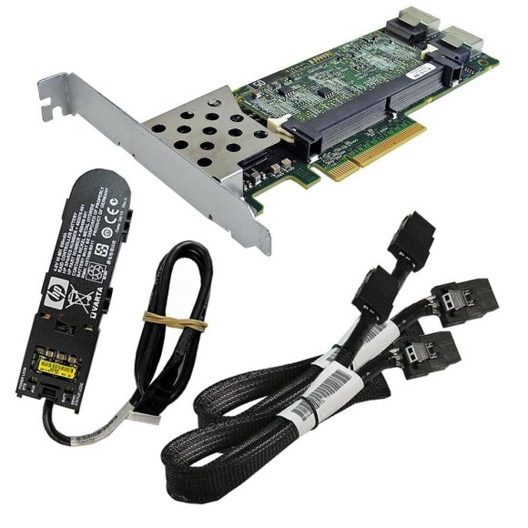

it connected with battery and have internal cache memory to store first on it , then store in the disks and the usage of the battery is when the power is off it keep the RAID controller work and keep the data inside the cache as it is until the power is up again , then write it in the disks.
**2-Software Based:**
In software-based RAID, the controller doesn’t have its own special hardware. So it use computer’s main processor and memory to do its job. It perform the same function as a hardware-based RAID controller, like managing the hard drives and keeping your data safe. But because it’s sharing resources with other programs on your computer, it might not make things run as fast. So, while it’s still helpful, it might not give you as big of a speed boost as a hardware-based RAID system.
in this case the RAID indicate to (redundant array of inexpensive disks) 
**3-Firmware Based:**
Firmware-based RAID controllers are like helpers built into the computer’s main board. They work with the main processor, just like software-based RAID. But they only implement when the computer starts up. Once the operating system is running, a special driver takes over the RAID job. These controllers aren’t as expensive as hardware ones, but they make the computer’s main processor work harder. People also call them hardware-assisted software RAID, hybrid model RAID, or fake RAID.

### RAID levels
**RAID 0 (Striping)**:
- **Data Layout**: Data is split into blocks and distributed across all drives (striping).
- **Advantages**: High performance due to parallel data writing/reading.
- **Disadvantages**: No redundancy. If one drive fails, all data is lost.
- **Use Case**: Suitable for applications needing high speed without concern for data loss (e.g., video editing).
- **Minimum Disk Number**: 2
- **Raw Space**: Sum of all disk capacities (e.g., for two 1TB disks, 2TB raw space).
- **Usable Space**: 100% of the raw space (e.g., 2TB usable for two 1TB disks).
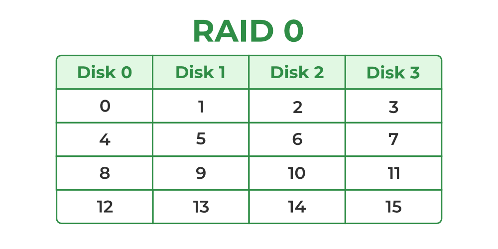
**RAID 1 (Mirroring)**:
- **Data Layout**: Data is copied identically (mirrored) on two or more drives.
- **Advantages**: Redundancy ensures data is safe if one drive fails.
- **Disadvantages**: Only half the total storage capacity is usable (since data is mirrored).
- **Use Case**: Ideal for critical systems where data redundancy is essential (e.g., database servers).
- **Minimum Disk Number**: 2
- **Raw Space**: Sum of all disk capacities (e.g., for two 1TB disks, 2TB raw space).
- **Usable Space**: 50% of the raw space (e.g., 1TB usable for two 1TB disks).
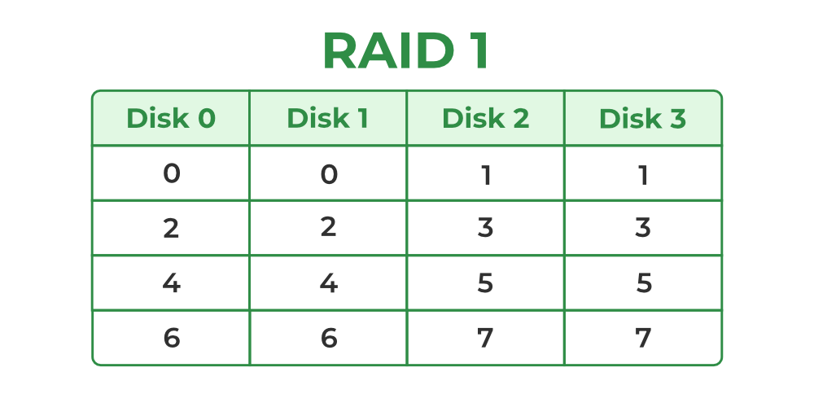
**RAID 5 (Striping with Parity)**:
- **Data Layout**: Data is striped across multiple drives with parity (error-checking information) distributed across drives.
- **Advantages**: Combines speed and redundancy. Can tolerate one drive failure without data loss.
- **Disadvantages**: Slower write speeds due to parity calculations. Requires at least three drives.
- **Use Case**: Balanced solution for performance, storage efficiency, and redundancy (e.g., file servers).
- **Minimum Disk Number**: 3
- **Raw Space**: Sum of all disk capacities (e.g., for three 1TB disks, 3TB raw space).
- **Usable Space**: (n - 1)×smallest disk size\text{(n - 1)} \times \text{smallest disk size}(n - 1)×smallest disk size, where n is the number of disks (e.g., 2TB usable for three 1TB disks).
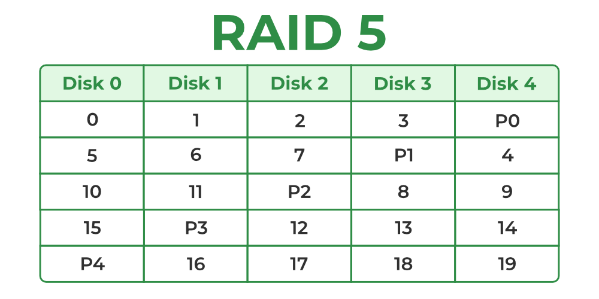
**RAID 6 (Striping with Double Parity)**:
- **Data Layout**: Similar to RAID 5 but with double parity, allowing two drive failures.
- **Advantages**: Tolerates up to two simultaneous drive failures.
- **Disadvantages**: Slower write performance than RAID 5 due to more parity calculations. Requires at least four drives.
- **Use Case**: Ideal for systems where higher fault tolerance is needed (e.g., mission-critical storage).
- **Minimum Disk Number**: 4
- **Raw Space**: Sum of all disk capacities (e.g., for four 1TB disks, 4TB raw space).
- **Usable Space**: (n - 2)×smallest disk size\text{(n - 2)} \times \text{smallest disk size}(n - 2)×smallest disk size (e.g., 2TB usable for four 1TB disks).
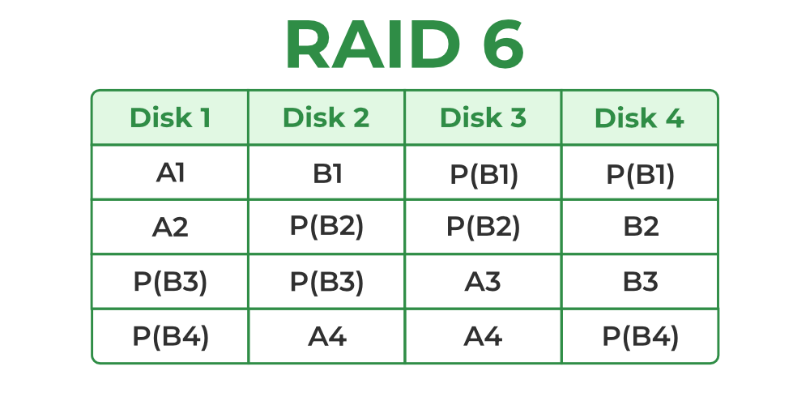
1. **RAID 10 (Mirroring + Striping)**:    
- **Data Layout**: Combines RAID 0 and RAID 1. Data is striped across multiple mirrored pairs.
- **Advantages**: High performance and redundancy. Can tolerate multiple drive failures (as long as drives in different mirrored pairs fail).
- **Disadvantages**: Expensive in terms of storage capacity (only half of the total drive capacity is usable). Requires at least four drives.
- **Use Case**: High-performance systems with high fault tolerance (e.g., database and enterprise applications).
- **Minimum Disk Number**: 4
- **Raw Space**: Sum of all disk capacities (e.g., for four 1TB disks, 4TB raw space).
- **Usable Space**: 50% of the raw space (e.g., 2TB usable for four 1TB disks).
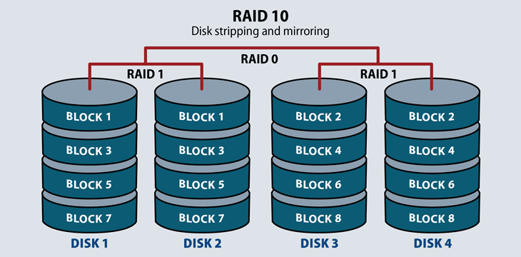

In summary(minimum number of disks , space):
- **RAID 0**: Minimum disks = 2, Usable space = 100% of raw space
- **RAID 1**: Minimum disks = 2, Usable space = 50% of raw space
- **RAID 5**: Minimum disks = 3, Usable space = (n - 1) disks
- **RAID 6**: Minimum disks = 4, Usable space = (n - 2) disks
- **RAID 10**: Minimum disks = 4, Usable space = 50% of raw space

### implementation
1-we will use three disks (sdb,sdc,sdb)
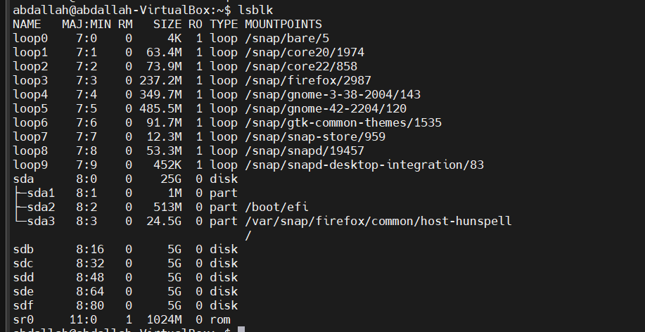

2-create the array
```
root@abdallah-VirtualBox:~# mdadm --create /dev/md0 --level=5 --raid-devices=3 /dev/sdb /dev/sdc /dev/sdd
root@abdallah-VirtualBox:~# watch cat /proc/mdstat
```
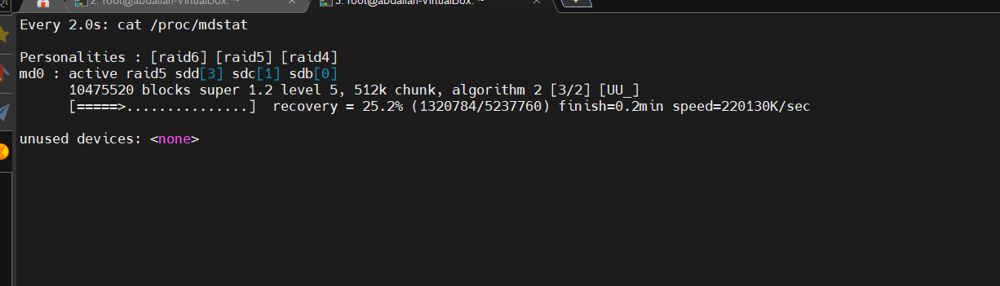

```
root@abdallah-VirtualBox:~# lsblk
```

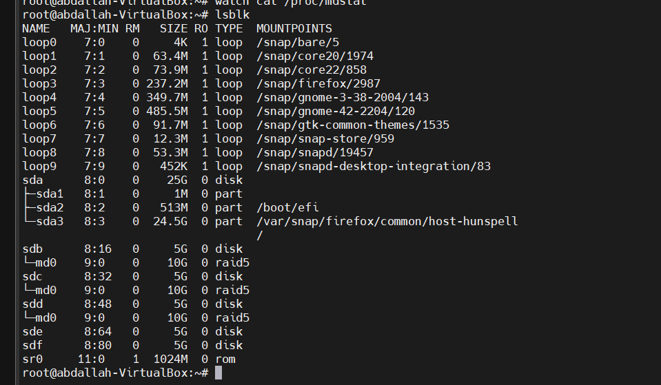

3-create the file system and mount
```
root@abdallah-VirtualBox:~# mkfs.ext4 /dev/md0
root@abdallah-VirtualBox:~# mount /dev/md0 /media
```

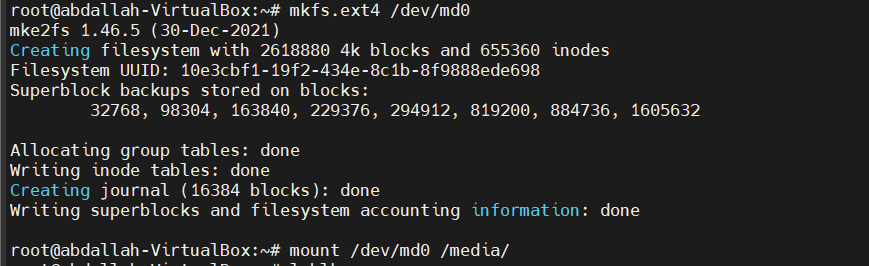

```
root@abdallah-VirtualBox:~# lsblk
```

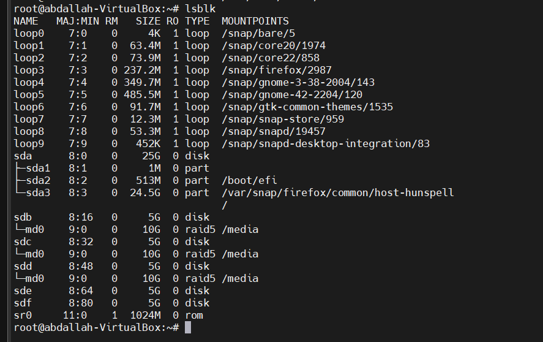

now the the array is created and mounted 
4- monitor the array space
```
root@abdallah-VirtualBox:~# df -h
Filesystem      Size  Used Avail Use% Mounted on
tmpfs           795M  1.8M  793M   1% /run
/dev/sda3        24G   12G   12G  52% /
tmpfs           3.9G     0  3.9G   0% /dev/shm
tmpfs           5.0M  4.0K  5.0M   1% /run/lock
/dev/sda2       512M  6.1M  506M   2% /boot/efi
tmpfs           795M  160K  795M   1% /run/user/1000
/dev/md0        9.8G   24K  9.3G   1% /media

```

the size of the array is 10G because we use three dusks with 5G ---> (15G - 5G(parity)) = 10G

for testing we can use  `mdadm -f` or `mdadm --force`
The `mdadm -f` command is used to manually mark a drive as **"failed"** in a RAID array managed by the `mdadm` tool in Linux. This is typically done to simulate a drive failure or to remove a drive from the array in preparation for replacement or other maintenance tasks.
```
root@abdallah-VirtualBox:~# mdadm /dev/md0 --fail /dev/sdd
```

To remove the failed device, you would follow up with a command like:

```
root@abdallah-VirtualBox:~# mdadm /dev/md0 --remove /dev/sdd
```

To add new disk or partition to the array 
```
root@abdallah-VirtualBox:~# mdadm /dev/md0 --add /dev/sdd
```


5-destroy the array

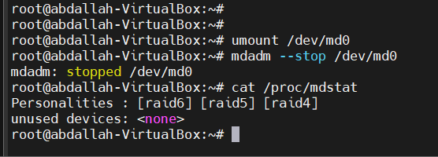

5-re-create the array

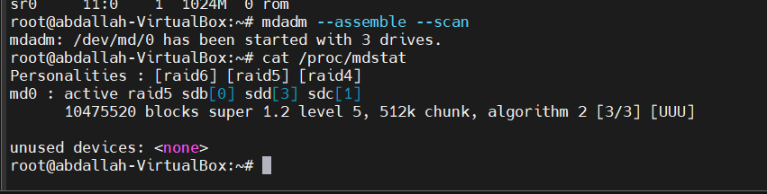


6-delete the array
```
root@abdallah-VirtualBox:~# umount /dev/md0
root@abdallah-VirtualBox:~# mdadm --stop /dev/md0
mdadm: stopped /dev/md0
root@abdallah-VirtualBox:~# mdadm --zero-superblock /dev/sdb
root@abdallah-VirtualBox:~# mdadm --zero-superblock /dev/sdc
root@abdallah-VirtualBox:~# mdadm --zero-superblock /dev/sdd
```
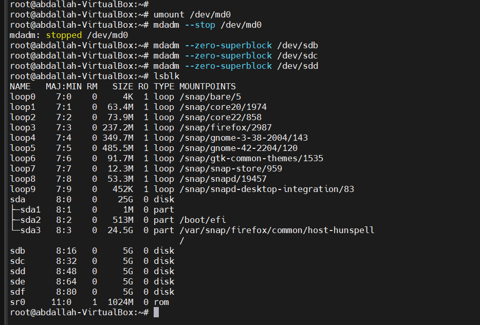


### create SW RAID for partitions 
1-create the partitions(note that the system id must be linux raid autodetect)
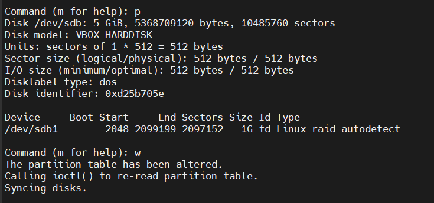

2-create the RAID 

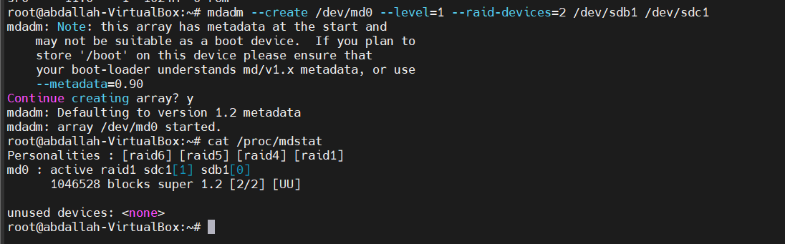

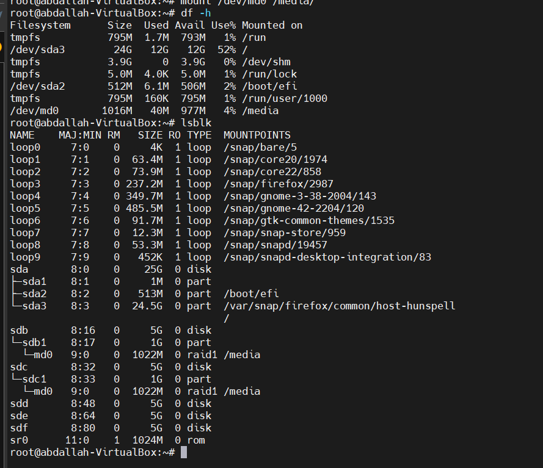


