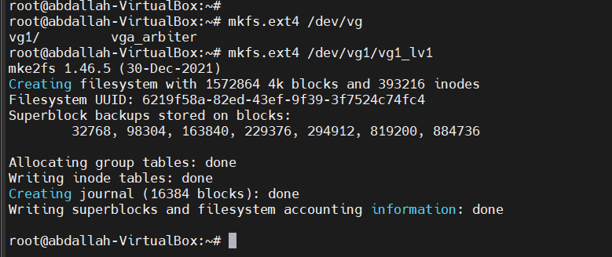

# Logical Volume Manager (LVM) Tutorial
a powerful storage management system that offers enhanced flexibility, scalability, and reliability for handling storage devices in Linux environments. **LVM** revolutionizes how disk partitions and physical storage are managed, providing an abstract layer that simplifies storage administration and facilitates efficient utilization of available resources. By introducing logical volumes, volume groups, and physical books, LVM enables seamless storage management, allowing administrators to dynamically resize, migrate, and allocate storage space as per their evolving needs.


### LVM is used for the following purposes:
- Creating single Logical volume of multiple physical volumes or entire hard disks
- Managing large hard disk farms by allowing disks to be added and replaced without downtime or service disruption, in combination with hot swapping.
- On small systems (like a desktop), instead of having to estimate at installation time how big a partition might need to be, LVM allows filesystems to be easily resized as needed.
- Performing consistent backups by taking snapshots of the logical volumes.
- Encrypting multiple physical partitions with one password.


- **VG (Volume Group)**:
    
    - Named `myvg` in this diagram, it combines multiple physical volumes (disks) into a single storage pool.
    - The volume group spans across three physical volumes: `hdisk1`, `hdisk2`, and `hdisk3`.
- **PV (Physical Volumes)**:
    
    - These are the actual storage devices, which are individual disks in this case (`hdisk1`, `hdisk2`, and `hdisk3`).
    - Each physical volume is divided into **PP (Physical Partitions)** of 32 MB size, represented in smaller blocks within each disk.
- **LV (Logical Volumes)**:
    
    - LVM abstracts these physical partitions into logical volumes that the user interacts with.
    - In this image, there are three logical volumes:
        - `/dev/hlv` (used for `/home` directory, with a `jfs` file system)
        - `/dev/srvlv` (used for `/var/www`, with an `ext3` file system)
        - `/dev/data` (used for `/data`, with a `jfs2` file system)
- **FS (File System)**:
    
    - Each logical volume is formatted with a specific file system (FS).
    - For example, `/dev/hlv` uses the `jfs` file system, `/dev/srvlv` uses `ext3`, and `/dev/data` uses `jfs2`.
- **MP (Mount Points)**:
    
    - The logical volumes are mounted at different points in the file system:
        - `/home` for the `hlv` logical volume
        - `/var/www` for the `srvlv` logical volume
        - `/data` for the `data` logical volume
### Explanation of Storage Structure:

- The physical storage (`hdisk1`, `hdisk2`, `hdisk3`) is divided into equal-sized **physical partitions** (PPs) of 32 MB each.
- These physical partitions are pooled together in the **volume group** `myvg`.
- Within this volume group, logical volumes (`hlv`, `srvlv`, `data`) are created by aggregating physical partitions across different physical volumes.
- Each logical volume is assigned a **file system** and a **mount point**, making the storage available for system use.

### What is an "Extent" in LVM?
An **extent** is the smallest unit of storage that LVM uses to allocate space within a volume group. When you create logical volumes (LVs) from a volume group (VG), LVM assigns extents to these logical volumes. Extents allow LVM to break down physical storage into manageable, uniform blocks, making it easier to resize and manage logical volumes.


### implementation 
1-convert physical partitions to physical volume (pp --> pv)
2-create volume group (vg) from physical volume (pv)
3-create logical volume (lv) from volume group (vg)
4-create file system for logical volume 
5-mount the logical volume


### steps 
1-create physical volume
```
root@abdallah-VirtualBox:~# pvcreate /dev/sdb1 /dev/sdc
  Physical volume "/dev/sdb1" successfully created.
  Physical volume "/dev/sdc" successfully created.
```

pvs & pvdisplay


2-create volume group
```
root@abdallah-VirtualBox:~# vgcreate vg1 /dev/sdb1 /dev/sdc
  Volume group "vg1" successfully created
```

pvs & pvdisplay


vgs & vgdisplay


3-create logical volume
```
root@abdallah-VirtualBox:~# lvcreate --size=6G --name vg1_lv1 vg1
  Logical volume "vg1_lv1" created.
```

pvs & vgs & lvs


```
root@abdallah-VirtualBox:~# ls -l /dev/vg1/vg1_lv1
lrwxrwxrwx 1 root root 7 Oct 15 10:37 /dev/vg1/vg1_lv1 -> ../dm-0
```

4-create file system



5-mount logical volume


```
root@abdallah-VirtualBox:~# cat /etc/lvm/backup/vg1
```


### how to extend & shrink the logical volume ?

**1-extend**

```
root@abdallah-VirtualBox:~#  lvextend --size +500M /dev/vg1/vg1_lv1
  Size of logical volume vg1/vg1_lv1 changed from 6.00 GiB (1536 extents) to <6.49 GiB (1661 extents).
  Logical volume vg1/vg1_lv1 successfully resized.
root@abdallah-VirtualBox:~#
root@abdallah-VirtualBox:~#
root@abdallah-VirtualBox:~#
root@abdallah-VirtualBox:~#
root@abdallah-VirtualBox:~# vgs
  VG  #PV #LV #SN Attr   VSize VFree
  vg1   2   1   0 wz--n- 6.99g 516.00m
root@abdallah-VirtualBox:~#
```

but the size of the logical volume still  6G


just force to update the inode table 
```
root@abdallah-VirtualBox:~# resize2fs /dev/vg1/vg1_lv1
resize2fs 1.46.5 (30-Dec-2021)
Filesystem at /dev/vg1/vg1_lv1 is mounted on /media; on-line resizing required
old_desc_blocks = 1, new_desc_blocks = 1
The filesystem on /dev/vg1/vg1_lv1 is now 1700864 (4k) blocks long.

```


**2-shrink**

1-unmount the logical volume (must here)
```
root@abdallah-VirtualBox:~# umount /dev/mapper/vg1-vg1_lv1
```

2-filesystem check
```
root@abdallah-VirtualBox:~# e2fsck -f /dev/vg1/vg1_lv1
e2fsck 1.46.5 (30-Dec-2021)
Pass 1: Checking inodes, blocks, and sizes
Pass 2: Checking directory structure
Pass 3: Checking directory connectivity
Pass 4: Checking reference counts
Pass 5: Checking group summary information
/dev/vg1/vg1_lv1: 2845/425984 files (0.1% non-contiguous), 53790/1700864 blocks

```

3-resize the file system
```
root@abdallah-VirtualBox:~# resize2fs /dev/vg1/vg1_lv1 6G
resize2fs 1.46.5 (30-Dec-2021)
Resizing the filesystem on /dev/vg1/vg1_lv1 to 1572864 (4k) blocks.
The filesystem on /dev/vg1/vg1_lv1 is now 1572864 (4k) blocks long.
```

4-reduce the logical volume size
```
root@abdallah-VirtualBox:~# lvreduce -L -500M /dev/vg1/vg1_lv1
  WARNING: Reducing active logical volume to 6.00 GiB.
  THIS MAY DESTROY YOUR DATA (filesystem etc.)
Do you really want to reduce vg1/vg1_lv1? [y/n]: y
  Size of logical volume vg1/vg1_lv1 changed from <6.49 GiB (1661 extents) to 6.00 GiB (1536 extents).
  Logical volume vg1/vg1_lv1 successfully resized.

```

5-mount the logical volme
```
root@abdallah-VirtualBox:~# mount /dev/vg1/vg1_lv1 /media/

```

the new size is 6G 


###  Linear LVM vs Striping LVM:
1- **_Linear LVM:_**
The linear configuration, often considered the **standard LVM** setup, involves adding multiple physical volumes (disks) to a volume group in a linear fashion. This means that data is sequentially stored across these volumes, utilizing one disk before moving on to the next.


While linear LVM provides a straightforward approach to storage expansion, it may not fully exploit the potential for parallel processing and increased throughput.

2-_Striping LVM_
In contrast, Striping LVM takes a more advanced approach by distributing data across multiple physical volumes simultaneously. This striping process creates a logical volume that spans the disks, allowing for parallel read and write operations. The result is a substantial boost in performance, making Striping LVM an attractive option for environments with high I/O and throughput demands.


1.**Stripe Creation:**
- The data is divided into segments known as “`stripes`”
- Each stripe is written to a specific disk in the striped logical volume `LV`.
**2. Parallel Writing of Stripes:**
- These stripes are simultaneously written across the multiple physical volumes `PVs`(disks).
**3. Balanced Distribution:**
- The stripes are distributed evenly across the disks, preventing a single disk from becoming a bottleneck.
**4. Enhanced IOPS and Throughput:**
- Through the parallel writing of stripes, LVM Striping significantly boosts the overall throughput and performance of the logical volume.


### implementation 
1.linear : is the default as the previous examples 
2.Striping :
just in creating the logical volume determine the number of stripping disks by using -i
```
root@abdallah-VirtualBox:~# lvcreate --size 15G --name vg1_lv1 -i 5 vg1
  Using default stripesize 64.00 KiB.
  Logical volume "vg1_lv1" created.
root@abdallah-VirtualBox:~# dmsetup deps /dev/vg1/vg1_lv1
5 dependencies  : (8, 80) (8, 64) (8, 48) (8, 32) (8, 16)
root@abdallah-VirtualBox:~#
```


equal number of stripes taken from the determined disks number


create the file system and mount 

```
root@abdallah-VirtualBox:~# mkfs.ext4 /dev/vg1/vg1_lv1
mke2fs 1.46.5 (30-Dec-2021)
Creating filesystem with 3932160 4k blocks and 983040 inodes
Filesystem UUID: 5ca05ecf-8030-47de-8f1f-22b68ccb4cd4
Superblock backups stored on blocks:
        32768, 98304, 163840, 229376, 294912, 819200, 884736, 1605632, 2654208

Allocating group tables: done
Writing inode tables: done
Creating journal (16384 blocks): done
Writing superblocks and filesystem accounting information: done

root@abdallah-VirtualBox:~# mount /dev/vg1/vg1_lv1 /media/
root@abdallah-VirtualBox:~#

```


### **snapshot**
In **LVM (Logical Volume Manager)**, a **snapshot** is a point-in-time copy of a logical volume (LV). It allows you to preserve the state of a volume at a specific moment without interrupting system operations, which is particularly useful for backup and testing purposes. Snapshots provide an efficient way to take consistent backups or experiment with changes without affecting the original volume.

### How LVM Snapshots Work:

LVM snapshots are **copy-on-write (COW)**. This means that when a snapshot is created, it doesn’t immediately duplicate all the data of the original logical volume. Instead, it only records changes made after the snapshot is taken. The original data remains untouched until it’s overwritten, at which point LVM saves the original data in the snapshot.


now  we have 246M data in the logical volume 


1-create the snapshot 
```
root@abdallah-VirtualBox:~# lvcreate --size 1G --snapshot --name vg1lv1snap --permission rw /dev/vg1/vg1lv1
  Logical volume "vg1lv1snap" created.
root@abdallah-VirtualBox:~#
root@abdallah-VirtualBox:~#
root@abdallah-VirtualBox:~#
root@abdallah-VirtualBox:~# lvs
  LV         VG  Attr       LSize Pool Origin Data%  Meta%  Move Log Cpy%Sync Convert
  vg1lv1     vg1 owi-aos--- 7.00g
  vg1lv1snap vg1 swi-a-s--- 1.00g      vg1lv1 0.01
	

```

2-make the changes which you want


the snap-logical volume record these changes 


if you need to back to the original data just unmount the logical volume and merge

4-merge the updates


now the size and the content is the old one 


### LVM over RAID
