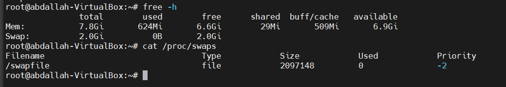
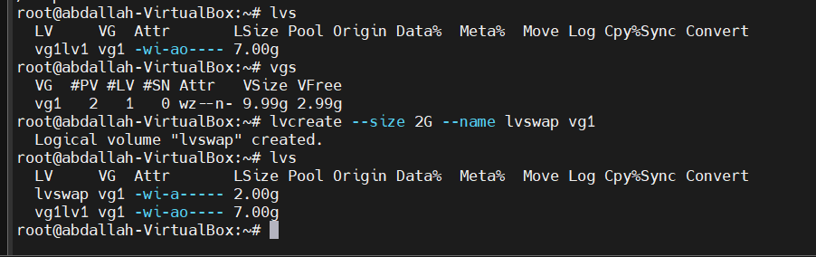
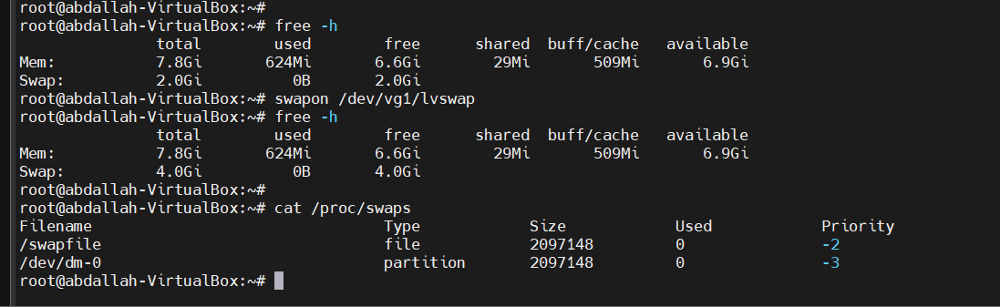
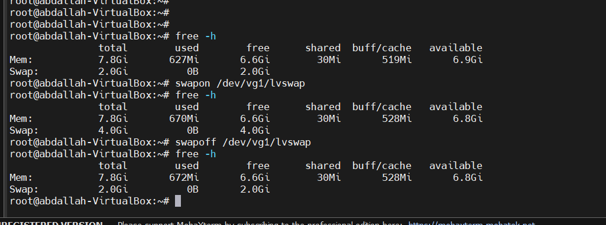
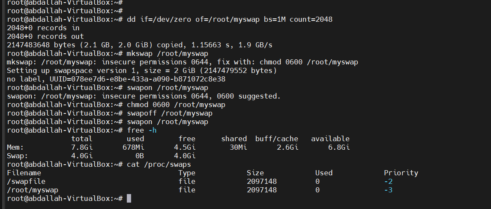

swap is a dedicated area on a storage device used to extend the system's virtual memory beyond the physical RAM capacity. When the system runs out of physical memory, it starts moving inactive pages (data) from RAM to the swap space, which frees up RAM for more active processes. While accessing swap is slower than RAM (since it's disk-based), it helps avoid system crashes due to out-of-memory errors.





there is a recommended size for the swap 

| Amount of RAM installed in system | Recommended swap space | Recommended swap space with hibernation |
| --------------------------------- | ---------------------- | --------------------------------------- |
| ≤ 2GB                             | 2X RAM                 | 3X RAM                                  |
| 2GB – 8GB                         | = RAM                  | 2X RAM                                  |
| 8GB – 64GB                        | 4G to 0.5X RAM         | 1.5X RAM                                |
| >64GB                             | Minimum 4GB            | Hibernation not recommended             |

### Two types of swap:

1. **Swap Partition**: A dedicated partition on the hard disk reserved for swap usage.
2. **Swap File**: A regular file on an existing partition used as swap space.

1- partition (we can use logical volume or separated partition)
first create the logical volume 
```
root@abdallah-VirtualBox:~# lvcreate --size 2G --name lvswap vg1
  Logical volume "lvswap" created.

```


create the file system (there is a spatial file system for swap)
```
root@abdallah-VirtualBox:~# mkswap /dev/vg1/lvswap
Setting up swapspace version 1, size = 2 GiB (2147479552 bytes)
no label, UUID=2a73cfad-f7f9-4cf9-bee3-0409e24dccd4

```

enable the swap

```
root@abdallah-VirtualBox:~# swapon /dev/vg1/lvswap
```


we can add it the /etc/fstab
```
/dev/vg1/lvswap     swap        swap    defaults              0       0
```

swapon & swapoff 



2-file swap
create file with the size of the swap which you want
```
root@abdallah-VirtualBox:~# dd if=/dev/zero of=/root/myswap bs=1M count=2048

```

create the file system 
```
root@abdallah-VirtualBox:~# mkswap /root/myswap
mkswap: /root/myswap: insecure permissions 0644, fix with: chmod 0600 /root/myswap
Setting up swapspace version 1, size = 2 GiB (2147479552 bytes)
no label, UUID=078ee7d6-e8be-433a-a090-b871072c8e38
```

change the permission to 0600 as recommended
```
root@abdallah-VirtualBox:~# chmod 0600 /root/myswap
```

enable the file swap
```
root@abdallah-VirtualBox:~# swapon /root/myswap
```

